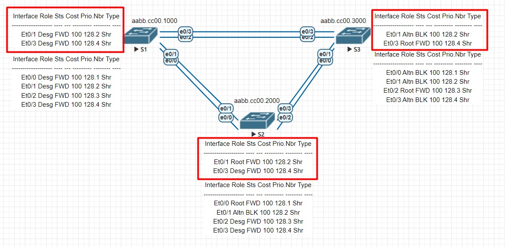

# Избыточность локальных сетей. STP 

### Выполнение
1. Воссоздаем схему и коммутацию, схема реализации п.7
2. Производим базовую настройку оборудования
   ```
   Current configuration : 1515 bytes
   !
   service password-encryption
   !
   hostname S1
   no logging console
   enable secret 5 $1$r75v$qOesv2PxA6c09Ak7XBfhl1
   !
   aaa new-model
   !
   !
   aaa authentication login default local
   aaa authorization exec default local
   !
   clock timezone MSK 3 0
   !
   no ip domain lookup
   !
   username cisco privilege 15 secret 5 $1$IE4e$CRkxPOAQmhp5JbkBmIuQl/
   !
   banner login ^CC
        *************************************************************
        **         All activity is subject to monitoring.          **
        **    Any UNAUTHORIZED access or use is PROHIBITED,        **
        **             and may result in PROSECUTION.              **
        **                         <<S1>>                          **
        *************************************************************
   ^C
   !
   line con 0
   logging synchronous
   line aux 0
   line vty 0 4
   transport input all
   ```
3. Настраиваем интерфейсы S1, S2, S3
    ```
    interface Vlan1
    description MANAGEMENT
    ip address 192.168.1.1 255.255.255.0
    end
   
    interface Vlan1
    description MANAGEMENT
    ip address 192.168.1.2 255.255.255.0
    end

    interface Vlan1
    description MANAGEMENT
    ip address 192.168.1.3 255.255.255.0
    end
   ```
4. Проверяем связь 
    ```
    S1#ping 192.168.1.2
    Type escape sequence to abort.
    Sending 5, 100-byte ICMP Echos to 192.168.1.2, timeout is 2 seconds:
    !!!!!
    Success rate is 100 percent (5/5), round-trip min/avg/max = 1/1/1 ms
    
    S1#ping 192.168.1.3
    Type escape sequence to abort.
    Sending 5, 100-byte ICMP Echos to 192.168.1.3, timeout is 2 seconds:
    !!!!!
    Success rate is 100 percent (5/5), round-trip min/avg/max = 1/1/1 ms
   
    S2#ping 192.168.1.3
    Type escape sequence to abort.
    Sending 5, 100-byte ICMP Echos to 192.168.1.3, timeout is 2 seconds:
    !!!!!
    Success rate is 100 percent (5/5), round-trip min/avg/max = 1/1/1 ms
    ```
5. Выключаем все порты, переводим в trunk, включаем e0/1,e0/3
   ```
   int range e0/0-3
   shutdown
   
   switchport trunk encapsulation dot1q
   switchport mode trunk
   
   int range e0/1,e0/3
   no shutdown
   ```
6. Смотрим данные протокола STP
   ```
   S1#sh spanning-tree
   
   VLAN0001
   Spanning tree enabled protocol ieee
   Root ID    Priority    32769
   Address     aabb.cc00.1000
   This bridge is the root
   Hello Time   2 sec  Max Age 20 sec  Forward Delay 15 sec
   
   Bridge ID  Priority    32769  (priority 32768 sys-id-ext 1)
   Address     aabb.cc00.1000
   Hello Time   2 sec  Max Age 20 sec  Forward Delay 15 sec
   Aging Time  300 sec
   
   Interface           Role Sts Cost      Prio.Nbr Type
   ------------------- ---- --- --------- -------- --------------------------------
   Et0/1               Desg FWD 100       128.2    Shr
   Et0/3               Desg FWD 100       128.4    Shr
   ```
   
   ```
   S2#sh spanning-tree
   
   VLAN0001
     Spanning tree enabled protocol ieee
     Root ID    Priority    32769
                Address     aabb.cc00.1000
                Cost        100
                Port        2 (Ethernet0/1)
                Hello Time   2 sec  Max Age 20 sec  Forward Delay 15 sec
   
     Bridge ID  Priority    32769  (priority 32768 sys-id-ext 1)
                Address     aabb.cc00.2000
                Hello Time   2 sec  Max Age 20 sec  Forward Delay 15 sec
                Aging Time  300 sec
   
   Interface           Role Sts Cost      Prio.Nbr Type
   ------------------- ---- --- --------- -------- --------------------------------
   Et0/1               Root FWD 100       128.2    Shr
   Et0/3               Desg FWD 100       128.4    Shr
   
   ```
   
   ```
   S3#sh spanning-tree
   
   VLAN0001
     Spanning tree enabled protocol ieee
     Root ID    Priority    32769
                Address     aabb.cc00.1000
                Cost        100
                Port        4 (Ethernet0/3)
                Hello Time   2 sec  Max Age 20 sec  Forward Delay 15 sec
   
     Bridge ID  Priority    32769  (priority 32768 sys-id-ext 1)
                Address     aabb.cc00.3000
                Hello Time   2 sec  Max Age 20 sec  Forward Delay 15 sec
                Aging Time  300 sec
   
   Interface           Role Sts Cost      Prio.Nbr Type
   ------------------- ---- --- --------- -------- --------------------------------
   Et0/1               Altn BLK 100       128.2    Shr
   Et0/3               Root FWD 100       128.4    Shr
   ```
   Согласно данных протокола STP S1 выбран как Root Bridge, поскольку при равенстве значений Priority 32769 имеет наименьшай BID за счет наименьшего Mac Address 
   1. S1 aabb.cc00.1000
   2. S2 aabb.cc00.2000
   3. S3 aabb.cc00.3000

7. Схема сети

8. Вопросы по схеме:
   * S1 является корневым коммутатором;
   * S1 имеет наименьший mac address при равенстве Priority;
   * Root port S2 - Et0/1, S3 - Et0/3;
   * Desg port S1 - Et0/1, Et0/3, S2 - Et0/3
   * Altn port S3 - E0/1 при равенстве cost, поскольку BID имеет наибольшее значение за счет наибольшего Mac Address, а сам порт не является корневым, 
9. Изменение стоимости Root порта на коммутаторе с Altn портом, приведет у перестроению сети
   ```
   interface Ethernet0/3
    switchport trunk encapsulation dot1q
    switchport mode trunk
    spanning-tree cost 18
   end
   
   S3#sh spanning-tree
   
   VLAN0001
     Spanning tree enabled protocol ieee
     Root ID    Priority    32769
                Address     aabb.cc00.1000
                Cost        18
                Port        4 (Ethernet0/3)
                Hello Time   2 sec  Max Age 20 sec  Forward Delay 15 sec
   
     Bridge ID  Priority    32769  (priority 32768 sys-id-ext 1)
                Address     aabb.cc00.3000
                Hello Time   2 sec  Max Age 20 sec  Forward Delay 15 sec
                Aging Time  300 sec
   
   Interface           Role Sts Cost      Prio.Nbr Type
   ------------------- ---- --- --------- -------- --------------------------------
   Et0/1               Desg FWD 100       128.2    Shr
   Et0/3               Root FWD 18        128.4    Shr
   
   ```
10. Отмена изменений на этом порту приведет к возврату сети в исходное состояние
   ```
   interface Ethernet0/3
    switchport trunk encapsulation dot1q
    switchport mode trunk
   end
      
      S3#sh spanning-tree
   
   VLAN0001
     Spanning tree enabled protocol ieee
     Root ID    Priority    32769
                Address     aabb.cc00.1000
                Cost        100
                Port        4 (Ethernet0/3)
                Hello Time   2 sec  Max Age 20 sec  Forward Delay 15 sec
   
     Bridge ID  Priority    32769  (priority 32768 sys-id-ext 1)
                Address     aabb.cc00.3000
                Hello Time   2 sec  Max Age 20 sec  Forward Delay 15 sec
                Aging Time  15  sec
   
   Interface           Role Sts Cost      Prio.Nbr Type
   ------------------- ---- --- --------- -------- --------------------------------
   Et0/1               Altn BLK 100       128.2    Shr
   Et0/3               Root FWD 100       128.4    Shr
   
   ```
