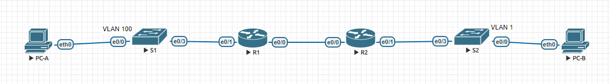

# Part 1: Build the Network and Configure Basic Device Settings

### Выполнение Ч1
1. Создаем адресный план
    ```
     Subnet_A - network 192.168.1.0 255.255.255.192 (Clients R1)
     Subnet_B - network 192.168.1.128 255.255.255.224 (Management)
     Subnet_C - network 192.168.1.208 255.255.255.240 (Clients R2)
    ```
2. Собираем топологию сети

3. Производим базовую настройку оборудования
   ```
   Current configuration : 1515 bytes
   !
   service password-encryption
   !
   hostname S1
   no logging console
   enable secret 5 $1$r75v$qOesv2PxA6c09Ak7XBfhl1
   !
   aaa new-model
   !
   !
   aaa authentication login default local
   aaa authorization exec default local
   !
   clock timezone MSK 3 0
   !
   no ip domain lookup
   !
   username cisco privilege 15 secret 5 $1$IE4e$CRkxPOAQmhp5JbkBmIuQl/
   !
   banner login ^CC
        *************************************************************
        **         All activity is subject to monitoring.          **
        **    Any UNAUTHORIZED access or use is PROHIBITED,        **
        **             and may result in PROSECUTION.              **
        **                         <<S1>>                          **
        *************************************************************
   ^C
   !
   line con 0
   logging synchronous
   line aux 0
   line vty 0 4
   transport input all
   ```
4. Настраиваем маршрутизацию и интерфейсы на R1
    ```
    interface Ethernet0/0
     ip address 10.0.0.1 255.255.255.252
    !
    interface Ethernet0/1.100
     description CLIENTS
     encapsulation dot1Q 100
     ip address 192.168.1.1 255.255.255.192
    !
    interface Ethernet0/1.200
     description MANAGEMENT
     encapsulation dot1Q 200
     ip address 192.168.1.129 255.255.255.224
    !
    ip route 0.0.0.0 0.0.0.0 10.0.0.2
    ```
5. Настраиваем маршрутизацию и интерфейсы на R1
    ```
    interface Ethernet0/0
     ip address 10.0.0.2 255.255.255.252
    !
    interface Ethernet0/1
     ip address 192.168.1.209 255.255.255.240
     ip helper-address 10.0.0.1
    !
    ip route 0.0.0.0 0.0.0.0 10.0.0.1
    ```
6. Производим базовую настройку свичей
    ```
    Настройки аналогичные п3
   ```
7. Создаем VLANs на S1
    ```
       VLAN Name                             Status    Ports
    ---- -------------------------------- --------- -------------------------------
    1    default                          active
    100  CLIENTS                          active    Et0/0
    200  MANAGEMENT                       active
    999  PARKING_LOT                      active    Et0/1, Et0/2
    1000 NATIVE                           active
    ```
8. Назначаем VLAN на интерфейсы коммутатора, назначаем сети
    ```
    interface Ethernet0/0
     description PC-A
     switchport access vlan 100
     switchport mode access
     load-interval 60
    !
    interface Ethernet0/1
     description PARKING_LOT
     switchport access vlan 999
     switchport mode access
     shutdown
    !
    interface Ethernet0/2
     description PARKING_LOT
     switchport access vlan 999
     switchport mode access
     shutdown
    !
    interface Ethernet0/3
     description R1
     switchport trunk allowed vlan 100,200,1000
     switchport trunk encapsulation dot1q
     switchport trunk native vlan 1000
     switchport mode trunk
     load-interval 60
    !   
    interface Vlan200
     ip address 192.168.1.130 255.255.255.224
    !
    ```
# Part 2: Configure and verify two DHCPv4 Servers on R1
### Выполнение Ч2
1. Создаем на R1 DHCPv4 pools исключаем адреса из выдачи
    ```
    ip dhcp excluded-address 192.168.1.1 192.168.1.5
    ip dhcp excluded-address 192.168.1.209 192.168.1.213
    !
    ip dhcp pool Subnet_A
     network 192.168.1.0 255.255.255.192
     default-router 192.168.1.1
     domain-name ccna-lab.com
     lease 2 12 30
    !
    ip dhcp pool R2_CLIENT_LAN
     network 192.168.1.208 255.255.255.240
     default-router 192.168.1.209
     domain-name ccna-lab.com
     lease 2 12 30
    ```
2. Сохраняем конфигурацию
3. Проверяем конфигурацию сервера
    ```
    R1# show ip dhcp pool
    
    Pool Subnet_A :
     Utilization mark (high/low)    : 100 / 0
     Subnet size (first/next)       : 0 / 0
     Total addresses                : 62
     Leased addresses               : 1
     Pending event                  : none
     1 subnet is currently in the pool :
     Current index        IP address range                    Leased addresses
     192.168.1.7          192.168.1.1      - 192.168.1.62      1
    
    Pool R2_CLIENT_LAN :
     Utilization mark (high/low)    : 100 / 0
     Subnet size (first/next)       : 0 / 0
     Total addresses                : 14
     Leased addresses               : 1
     Pending event                  : none
     1 subnet is currently in the pool :
     Current index        IP address range                    Leased addresses
     192.168.1.215        192.168.1.209    - 192.168.1.222     1
    ```
    ```
    R1# show ip dhcp binding
    Bindings from all pools not associated with VRF:
    IP address          Client-ID/              Lease expiration        Type
                        Hardware address/
                        User name
    192.168.1.6         0100.5079.6668.01       Nov 02 2023 11:22 PM    Automatic
    192.168.1.214       0100.5079.6668.02       Nov 02 2023 11:17 PM    Automatic
    ```
    ```
    R1# show ip dhcp server statistics
    Memory usage         58616
    Address pools        2
    Database agents      0
    Automatic bindings   2
    Manual bindings      0
    Expired bindings     0
    Malformed messages   0
    Secure arp entries   0
    
    Message              Received
    BOOTREQUEST          0
    DHCPDISCOVER         10
    DHCPREQUEST          6
    DHCPDECLINE          0
    DHCPRELEASE          0
    DHCPINFORM           0
    
    Message              Sent
    BOOTREPLY            0
    DHCPOFFER            6
    DHCPACK              6
    DHCPNAK              0
    ```
4. Получаем настройки на PC-A, проверяем связность
    ```
    VPCS> ip dhcp
    DDORA IP 192.168.1.6/26 GW 192.168.1.1
    
    VPCS> ping 192.168.1.1
    84 bytes from 192.168.1.1 icmp_seq=1 ttl=255 time=0.573 ms
    84 bytes from 192.168.1.1 icmp_seq=2 ttl=255 time=0.649 ms
    84 bytes from 192.168.1.1 icmp_seq=3 ttl=255 time=0.589 ms
    84 bytes from 192.168.1.1 icmp_seq=4 ttl=255 time=0.676 ms
    84 bytes from 192.168.1.1 icmp_seq=5 ttl=255 time=0.626 ms
    ```
# Part 3: Configure and verify a DHCP Relay on R2
