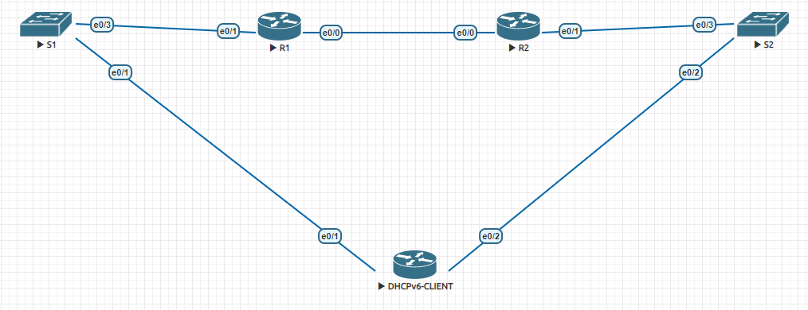
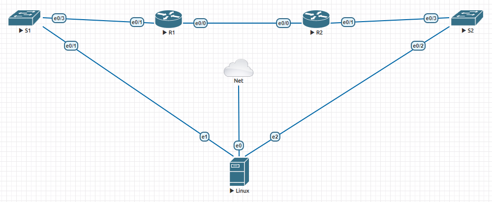

# Part 1: Build the Network and Configure Basic Device Settings

### Выполнение Ч1
1. Собираем топологию сети

2. Производим базовую настройку свичей
   ```
   Current configuration : 1515 bytes
   !
   service password-encryption
   !
   hostname S1
   no logging console
   enable secret 5 $1$r75v$qOesv2PxA6c09Ak7XBfhl1
   !
   aaa new-model
   !
   !
   aaa authentication login default local
   aaa authorization exec default local
   !
   clock timezone MSK 3 0
   !
   no ip domain lookup
   !
   username cisco privilege 15 secret 5 $1$IE4e$CRkxPOAQmhp5JbkBmIuQl/
   !
   banner login ^CC
        *************************************************************
        **         All activity is subject to monitoring.          **
        **    Any UNAUTHORIZED access or use is PROHIBITED,        **
        **             and may result in PROSECUTION.              **
        **                         <<S1>>                          **
        *************************************************************
   ^C
   !
   line con 0
   logging synchronous
   line aux 0
   line vty 0 4
   transport input all
   ```
3. Производим базовую настройку роутеров
   ```
   Current configuration : 1515 bytes
   !
   service password-encryption
   !
   hostname R1
   no logging console
   enable secret 5 $1$r75v$qOesv2PxA6c09Ak7XBfhl1
   !
   aaa new-model
   !
   !
   aaa authentication login default local
   aaa authorization exec default local
   !
   clock timezone MSK 3 0
   !
   no ip domain lookup
   !
   username cisco privilege 15 secret 5 $1$IE4e$CRkxPOAQmhp5JbkBmIuQl/
   !
   banner login ^CC
        *************************************************************
        **         All activity is subject to monitoring.          **
        **    Any UNAUTHORIZED access or use is PROHIBITED,        **
        **             and may result in PROSECUTION.              **
        **                         <<R1>>                          **
        *************************************************************
   ^C
   !
   line con 0
   logging synchronous
   line aux 0
   line vty 0 4
   transport input all
   ```
4. Настраиваем интерфейсы на R1 и R2
    ```
    R1#sh run int e0/0
    !
    interface Ethernet0/0
     no ip address
     ipv6 address FE80::1 link-local
     ipv6 address 2001:DB8:ACAD:2::1/64
     ipv6 enable
    end
    
    R1#sh run int e0/1
    !
    interface Ethernet0/1
     no ip address
     ipv6 address FE80::1 link-local
     ipv6 address 2001:DB8:ACAD:1::1/64
     ipv6 enable
    end
    
    R2#sh run int e0/0
    !
    interface Ethernet0/0
     no ip address
     ipv6 address FE80::2 link-local
     ipv6 address 2001:DB8:ACAD:2::2/64
     ipv6 enable
    end
    
    R2#sh run int e0/1
    !
    interface Ethernet0/1
     no ip address
     ipv6 address FE80::1 link-local
     ipv6 address 2001:DB8:ACAD:3::1/64
     ipv6 enable
    end
   
    default route R1 - ipv6 route ::/0 2001:DB8:ACAD:2::2
    default route R2 - ipv6 route ::/0 2001:DB8:ACAD:2::1
   
    R2#ping  2001:DB8:ACAD:1::1
    Type escape sequence to abort.
    Sending 5, 100-byte ICMP Echos to 2001:DB8:ACAD:1::1, timeout is 2 seconds:
    !!!!!
    Success rate is 100 percent (5/5), round-trip min/avg/max = 1/1/1 ms
    ```
# Part 2: Verify SLAAC Address Assignment from R1
### Выполнение Ч2
1. Проверяем получение IPv6 на клиенте используя метод SLAAC    
    ```
    DHCPPv6-CLIENT#sh run int e0/1
    !
    interface Ethernet0/1
    no ip address
    ipv6 address autoconfig
    ipv6 enable
    end
    
    DHCPPv6-CLIENT#sh run int e0/2
    !
    interface Ethernet0/2
    no ip address
    ipv6 address autoconfig
    ipv6 enable
    end
    
    DHCPPv6-CLIENT#sh ipv6 interface brief
   
    Ethernet0/1            [up/up]
        FE80::A8BB:CCFF:FE00:5010
        2001:DB8:ACAD:1:A8BB:CCFF:FE00:5010
    Ethernet0/2            [up/up]
        FE80::A8BB:CCFF:FE00:5020
        2001:DB8:ACAD:3:A8BB:CCFF:FE00:5020
    ```
# Part 3: Configure and Verify a DHCPv6 server on R1
### Выполнение Ч3



1. Проверяем конфигурацию PC-A.
   ```
   [root@localhost ~]# nmcli dev show ens4
   GENERAL.DEVICE:                         ens4
   GENERAL.TYPE:                           ethernet
   GENERAL.HWADDR:                         00:50:01:00:05:01
   GENERAL.MTU:                            1500
   GENERAL.STATE:                          100 (connected)
   GENERAL.CONNECTION:                     ens4
   GENERAL.CON-PATH:                       /org/freedesktop/NetworkManager/ActiveConnection/6
   WIRED-PROPERTIES.CARRIER:               on
   IP6.ADDRESS[1]:                         2001:db8:acad:1:8be9:70f6:c5b:ba2e/64
   IP6.ADDRESS[2]:                         fe80::bf37:c8c0:65d4:113e/64
   IP6.GATEWAY:                            fe80::1
   IP6.ROUTE[1]:                           dst = fe80::/64, nh = ::, mt = 103
   IP6.ROUTE[2]:                           dst = 2001:db8:acad:1::/64, nh = ::, mt = 103
   IP6.ROUTE[3]:                           dst = ::/0, nh = fe80::1, mt = 103
   IP6.ROUTE[4]:                           dst = ff00::/8, nh = ::, mt = 256, table=255
   ```
2. Настраиваем R1 для предоставления DHCPv6 STATELESS.
   ```
   ipv6 dhcp pool R1-STATELESS
    dns-server 2001:DB8:ACAD::254
    domain-name STATELESS.com

   interface Ethernet0/1
    no ip address
    ipv6 address FE80::1 link-local
    ipv6 address 2001:DB8:ACAD:1::1/64
    ipv6 enable
    ipv6 nd other-config-flag
    ipv6 dhcp server R1-STATELESS
   end

   [root@localhost ~]# nmcli dev show ens4

   GENERAL.DEVICE:                         ens4
   GENERAL.TYPE:                           ethernet
   GENERAL.HWADDR:                         00:50:01:00:05:01
   GENERAL.MTU:                            1500
   GENERAL.STATE:                          100 (connected)
   GENERAL.CONNECTION:                     ens4
   GENERAL.CON-PATH:                       /org/freedesktop/NetworkManager/ActiveConnection/2
   WIRED-PROPERTIES.CARRIER:               on
   IP6.ADDRESS[1]:                         2001:db8:acad:1:8be9:70f6:c5b:ba2e/64
   IP6.ADDRESS[2]:                         fe80::bf37:c8c0:65d4:113e/64
   IP6.GATEWAY:                            fe80::1
   IP6.ROUTE[1]:                           dst = fe80::/64, nh = ::, mt = 101
   IP6.ROUTE[2]:                           dst = 2001:db8:acad:1::/64, nh = ::, mt = 101
   IP6.ROUTE[3]:                           dst = ::/0, nh = fe80::1, mt = 101
   IP6.ROUTE[4]:                           dst = ff00::/8, nh = ::, mt = 256, table=255
   IP6.DNS[1]:                             2001:db8:acad::254

   [root@localhost ~]# cat /etc/resolv.conf
   
   # Generated by NetworkManager
   search STATELESS.com
   nameserver 2001:db8:acad::254
   ```
# Part 4: Configure a stateful DHCPv6 server on R1
### Выполнение Ч3
1. Настраиваем R1 для предоставления DHCPv6 STATEFUL.
   ```
   ipv6 dhcp pool R2-STATEFUL
    address prefix 2001:DB8:ACAD:3:AAA::/80
    dns-server 2001:DB8:ACAD::254
    domain-name STATEFUL.com

   interface Ethernet0/0
    no ip address
    ipv6 address FE80::1 link-local
    ipv6 address 2001:DB8:ACAD:2::1/64
    ipv6 enable
    ipv6 dhcp server R2-STATEFUL
   end
   ```
# Part 5: Configure and verify DHCPv6 relay on R2
1. Проверяем конфигурацию PC-B
   ```
   [root@localhost ~]# nmcli dev show ens5
   GENERAL.DEVICE:                         ens5
   GENERAL.TYPE:                           ethernet
   GENERAL.HWADDR:                         00:50:01:00:05:02
   GENERAL.MTU:                            1500
   GENERAL.STATE:                          100 (connected)
   GENERAL.CONNECTION:                     ens5
   GENERAL.CON-PATH:                       /org/freedesktop/NetworkManager/ActiveConnection/7
   WIRED-PROPERTIES.CARRIER:               on
   IP6.ADDRESS[1]:                         2001:db8:acad:3:b4e6:5853:4524:f829/64
   IP6.ADDRESS[2]:                         fe80::4a42:184:be5d:3398/64
   IP6.GATEWAY:                            fe80::1
   IP6.ROUTE[1]:                           dst = fe80::/64, nh = ::, mt = 104
   IP6.ROUTE[2]:                           dst = 2001:db8:acad:3::/64, nh = ::, mt = 104
   IP6.ROUTE[3]:                           dst = ::/0, nh = fe80::1, mt = 104
   IP6.ROUTE[4]:                           dst = ff00::/8, nh = ::, mt = 256, table=255
   ```
2. Настраиваем RELAY на R2
   ```
   interface Ethernet0/1
    no ip address
    ipv6 address FE80::1 link-local
    ipv6 address 2001:DB8:ACAD:3::1/64
    ipv6 enable
    ipv6 nd managed-config-flag
    ipv6 dhcp relay destination 2001:DB8:ACAD:2::1 Ethernet0/0
   end
   ```
3. Получаем IPv6 адрес от DHCPv6 
   ```
   [root@localhost ~]# nmcli dev show ens5
   GENERAL.DEVICE:                         ens5
   GENERAL.TYPE:                           ethernet
   GENERAL.HWADDR:                         00:50:01:00:05:02
   GENERAL.MTU:                            1500
   GENERAL.STATE:                          100 (connected)
   GENERAL.CONNECTION:                     ens5
   GENERAL.CON-PATH:                       /org/freedesktop/NetworkManager/ActiveConnection/5
   WIRED-PROPERTIES.CARRIER:               on
   IP6.ADDRESS[1]:                         2001:db8:acad:3:b4e6:5853:4524:f829/64
   IP6.ADDRESS[2]:                         2001:db8:acad:3:aaa:95a7:2cc:5137/128
   IP6.ADDRESS[3]:                         fe80::4a42:184:be5d:3398/64
   IP6.GATEWAY:                            fe80::1
   IP6.ROUTE[1]:                           dst = fe80::/64, nh = ::, mt = 102
   IP6.ROUTE[2]:                           dst = 2001:db8:acad:3::/64, nh = ::, mt = 102
   IP6.ROUTE[3]:                           dst = ::/0, nh = fe80::1, mt = 102
   IP6.ROUTE[4]:                           dst = ff00::/8, nh = ::, mt = 256, table=255
   IP6.ROUTE[5]:                           dst = 2001:db8:acad:3:aaa:95a7:2cc:5137/128, nh = ::, mt = 102
   IP6.DNS[1]:                             2001:db8:acad::254
   ```
4. Проверяем связность
   ```
   [root@localhost ~]# ping 2001:db8:acad:2::1
   PING 2001:db8:acad:2::1(2001:db8:acad:2::1) 56 data bytes
   64 bytes from 2001:db8:acad:2::1: icmp_seq=1 ttl=64 time=11.1 ms
   64 bytes from 2001:db8:acad:2::1: icmp_seq=2 ttl=64 time=1.24 ms
   64 bytes from 2001:db8:acad:2::1: icmp_seq=3 ttl=64 time=1.49 ms
   64 bytes from 2001:db8:acad:2::1: icmp_seq=4 ttl=64 time=1.36 ms
   ^C
   --- 2001:db8:acad:2::1 ping statistics ---
   4 packets transmitted, 4 received, 0% packet loss, time 9ms
   rtt min/avg/max/mdev = 1.242/3.793/11.084/4.210 ms
   [root@localhost ~]# ping 2001:db8:acad:1::1
   PING 2001:db8:acad:1::1(2001:db8:acad:1::1) 56 data bytes
   64 bytes from 2001:db8:acad:1::1: icmp_seq=1 ttl=64 time=11.9 ms
   64 bytes from 2001:db8:acad:1::1: icmp_seq=2 ttl=64 time=1.39 ms
   64 bytes from 2001:db8:acad:1::1: icmp_seq=3 ttl=64 time=1.35 ms
   64 bytes from 2001:db8:acad:1::1: icmp_seq=4 ttl=64 time=1.31 ms
   ^C
   --- 2001:db8:acad:1::1 ping statistics ---
   4 packets transmitted, 4 received, 0% packet loss, time 8ms
   rtt min/avg/max/mdev = 1.309/3.984/11.881/4.559 ms
   [root@localhost ~]# ping 2001:db8:acad:2::2
   PING 2001:db8:acad:2::2(2001:db8:acad:2::2) 56 data bytes
   64 bytes from 2001:db8:acad:2::2: icmp_seq=1 ttl=63 time=1.56 ms
   64 bytes from 2001:db8:acad:2::2: icmp_seq=2 ttl=63 time=1.64 ms
   64 bytes from 2001:db8:acad:2::2: icmp_seq=3 ttl=63 time=1.72 ms
   64 bytes from 2001:db8:acad:2::2: icmp_seq=4 ttl=63 time=1.52 ms
   ^C
   --- 2001:db8:acad:2::2 ping statistics ---
   4 packets transmitted, 4 received, 0% packet loss, time 8ms
   rtt min/avg/max/mdev = 1.518/1.610/1.724/0.084 ms
   [root@localhost ~]# ping 2001:db8:acad:3::1
   PING 2001:db8:acad:3::1(2001:db8:acad:3::1) 56 data bytes
   64 bytes from 2001:db8:acad:3::1: icmp_seq=1 ttl=64 time=11.0 ms
   64 bytes from 2001:db8:acad:3::1: icmp_seq=2 ttl=64 time=1.31 ms
   64 bytes from 2001:db8:acad:3::1: icmp_seq=3 ttl=64 time=1.30 ms
   64 bytes from 2001:db8:acad:3::1: icmp_seq=4 ttl=64 time=1.29 ms
   ^C
   --- 2001:db8:acad:3::1 ping statistics ---
   4 packets transmitted, 4 received, 0% packet loss, time 8ms
   rtt min/avg/max/mdev = 1.285/3.732/11.035/4.216 ms
   ```