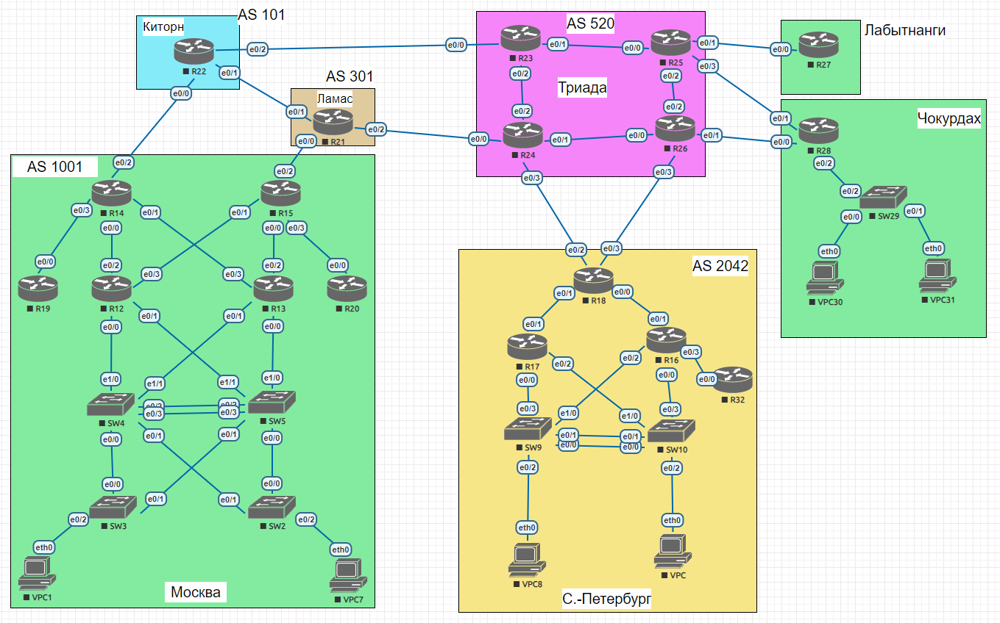

# Проектирование сети

### Выполнение

Лаботаторная схема сети


1. Распределяем и документируем адресное пространсво для лабораторного стенда.
* Выделим отдельное /16 адресное пространспо под каждый сегмент сети лабораторного стенда, а в каждом сегменте сети выделим /24 под сервисы
    - 10.0.0.0/16 - для общих сервисов всех сегментов, такие как сервера, и др.
      - 10.0.2.0/24 - адресное пространство под p2p линки между сегментами (/31) 
    - 10.10.0.0/16 - Москва
      - 10.10.0.0/24 - адресное пространство под loopback
      - 10.10.1.0/24 - адресное пространство под management
      - 10.10.2.0/24 - адресное пространство под p2p линки (/31)
      - 10.10.101.0/24 - адресное пространство под users_1 network
      - 10.10.102.0/24 - адресное пространство под users_2 network
      - ...
    - 10.20.0.0/16 - Питер
      - 10.20.0.0/24 - адресное пространство под loopback
      - 10.20.1.0/24 - адресное пространство под management
      - 10.20.2.0/24 - адресное пространство под p2p линки (/31)
      - 10.20.101.0/24 - адресное пространство под users_1 network
      - 10.20.102.0/24 - адресное пространство под users_2 network
      - ...
    - 10.30.0.0/16 - Киторн
      - 10.30.0.0/24 - адресное пространство под loopback
      - 10.30.1.0/24 - адресное пространство под management
      - 10.30.2.0/24 - адресное пространство под p2p линки (/31)
      - 10.30.101.0/24 - адресное пространство под users_1 network
      - 10.30.102.0/24 - адресное пространство под users_2 network
      - ...
    - 10.40.0.0/16 - Ламас
      - 10.40.0.0/24 - адресное пространство под loopback
      - 10.40.1.0/24 - адресное пространство под management
      - 10.40.2.0/24 - адресное пространство под p2p линки (/31)
      - 10.40.101.0/24 - адресное пространство под users_1 network
      - 10.40.102.0/24 - адресное пространство под users_2 network
      - ...
    - 10.50.0.0/16 - Триада
      - 10.50.0.0/24 - адресное пространство под loopback
      - 10.50.1.0/24 - адресное пространство под management
      - 10.50.2.0/24 - адресное пространство под p2p линки (/31)
      - 10.50.101.0/24 - адресное пространство под users_1 network
      - 10.50.102.0/24 - адресное пространство под users_2 network
      - ...
    - 10.60.0.0/16 - Лабытнанги
      - 10.60.0.0/24 - адресное пространство под loopback
      - 10.60.1.0/24 - адресное пространство под management
      - 10.60.2.0/24 - адресное пространство под p2p линки (/31)
      - 10.60.101.0/24 - адресное пространство под users_1 network
      - 10.60.102.0/24 - адресное пространство под users_2 network
      - ...
    - 10.70.0.0/16 - Чокурдах
      - 10.70.0.0/24 - адресное пространство под loopback
      - 10.70.1.0/24 - адресное пространство под management
      - 10.70.2.0/24 - адресное пространство под p2p линки (/31)
      - 10.70.101.0/24 - адресное пространство под users_1 network
      - 10.70.102.0/24 - адресное пространство под users_2 network
      - ...
2. Настраиваем ip адреса на каждом активном порту

   ### **Москва:**

    | Hostname   | Interface     | Description      | IPv4-address   | Gateway        |
    |------------|---------------|------------------|----------------|----------------|
    | ✔ **R14**  | Loopback0     |                  | 10.10.0.14     |                |
    |            | Ethernet0/0   | link-to-R12      | 10.10.2.5/31   |                |
    |            | Ethernet0/1   | link-to-R13      | 10.10.2.7/31   |                |
    |            | ⬆ Ethernet0/2 | link-to-R22      | 10.0.0.3/31    |                |
    |            | Ethernet0/3   | link-to-R19      | 10.10.2.3/31   |                |
    | ✔ **R15**  | Loopback0     |                  | 10.10.0.15     |                |
    |            | Ethernet0/0   | link-to-R13      | 10.10.2.11/31  |                |
    |            | Ethernet0/1   | link-to-R12      | 10.10.2.9/31   |                |
    |            | Ethernet0/2   | link-to-R21      | 10.0.0.5/31    |                |
    |            | Ethernet0/3   | link-to-R20      | 10.10.2.13/31  |                |
    | ✔ **R19**  | Loopback0     |                  | 10.10.0.19     |                |
    |            | Ethernet0/0   | link-to-R14      | 10.10.2.2/31   |                |
    |            | Ethernet0/1   | free             |                |                |
    |            | Ethernet0/2   | free             |                |                |
    |            | Ethernet0/3   | free             |                |                |
    | ✔ **R12**  | Loopback0     |                  | 10.10.0.12     |                |
    |            | Ethernet0/0   | link-to-SW4      | 10.10.2.15/31  |                |
    |            | Ethernet0/1   | link-to-SW5      | 10.10.2.17/31  |                |
    |            | Ethernet0/2   | link-to-R14      | 10.10.2.4/31   |                |
    |            | Ethernet0/3   | link-to-R15      | 10.10.2.8/31   |                |
    | ✔ **R13**  | Loopback0     |                  | 10.10.0.13     |                |
    |            | Ethernet0/0   | link-to-SW5      | 10.10.2.21/31  |                |
    |            | Ethernet0/1   | link-to-SW4      | 10.10.2.19/31  |                |
    |            | Ethernet0/2   | link-to-R15      | 10.10.2.10/31  |                |
    |            | Ethernet0/3   | link-to-R14      | 10.10.2.6/31   |                |
    | ✔ **R20**  | Loopback0     |                  | 10.10.0.20     |                |
    |            | Ethernet0/0   | link-to-R15      | 10.10.2.12/31  |                |
    |            | Ethernet0/1   | free             |                |                |
    |            | Ethernet0/2   | free             |                |                |
    |            | Ethernet0/3   | free             |                |                |
    | ✔ **SW4**  | Loopback0     |                  | 10.10.0.4      |                |
    |            | Ethernet0/0   | link-to-SW3      | 10.10.2.12/31  |                |
    |            | Ethernet0/1   | link-to-SW2      |                |                |
    |            | Ethernet0/2   | po1.link-to-SW5  |                |                |
    |            | Ethernet0/3   | po1.link-to-SW5  |                |                |
    |            | Ethernet1/0   | link-to-R12      | 10.10.2.14/31  |                |
    |            | Ethernet1/1   | link-to-R13      |                |                |
    |            | Port-channel1 | po1.link-to-SW5  | 10.10.2.23/31  |                |
    |            | Vlan101       | int vlan 101     | 10.10.101.2/24 |                |
    |            |               | vrrp-101         | 10.10.101.1/24 |                |
    |            | Vlan102       | int vlan 102     | 10.10.102.2/24 |                |
    |            |               | vrrp-102         | 10.10.102.1/24 |                |
    | ✔ **SW5**  | Loopback0     |                  | 10.10.0.5      |                |
    |            | Ethernet0/0   | link-to-SW2      |                |                |
    |            | Ethernet0/1   | link-to-SW3      |                |                |
    |            | Ethernet0/2   | po1.link-to-SW4  |                |                |
    |            | Ethernet0/3   | po1.link-to-SW4  |                |                |
    |            | Ethernet1/0   | link-to-R13      |                |                |
    |            | Ethernet1/1   | link-to-R12      |                |                |
    |            | Port-channel1 | po1.link-to-SW4  | 10.10.2.22/31  |                |
    |            | Vlan101       | int vlan 101     | 10.10.101.3/24 |                |
    |            |               | vrrp-101         | 10.10.101.1/24 |                |
    |            | Vlan102       | int vlan 102     | 10.10.102.3/24 |                |
    |            |               | vrrp-102         | 10.10.102.1/24 |                |
    | ✔ **SW3**  | Loopback0     |                  | 10.10.0.3      |                |
    |            | Ethernet0/0   | link-to-SW4      |                |                |
    |            | Ethernet0/1   | link-to-SW5      |                |                |
    |            | Ethernet0/2   | link-to-VPC1     |                |                |
    |            | Ethernet0/3   | free             |                |                |
    | ✔ **SW2**  | Loopback0     |                  | 10.10.0.2      |                |
    |            | Ethernet0/0   | link-to-SW5      |                |                |
    |            | Ethernet0/1   | link-to-SW4      |                |                |
    |            | Ethernet0/2   | link-to-VPC7     |                |                |
    |            | Ethernet0/3   | free             |                |                |
    | ✔ **VPC1** | VPCS1         | 10.10.101.100/24 |                | 10.10.101.1/24 |
    | ✔ **VPC2** | VPCS1         | 10.10.102.100/24 |                | 10.10.102.1/24 |

   ###  **С.-Петербург:**

    | Hostname   | Interface     | Description | IPv4-address | Gateway        |
    |------------|---------------|-------------|--------------|----------------|
    | ✔ **R18**  | Loopback0     |             | 10.20.0.18   |                |
    |            | Ethernet0/0   |             |              |                |
    |            | Ethernet0/1   |             |              |                |
    |            | Ethernet0/2   |             |              |                |
    |            | Ethernet0/3   |             |              |                |
    | ✔ **R17**  | Loopback0     |             | 10.20.0.17   |                |
    |            | Ethernet0/0   |             |              |                |
    |            | Ethernet0/1   |             |              |                |
    |            | Ethernet0/2   |             |              |                |
    |            | Ethernet0/3   |             |              |                |
    | ✔ **R16**  | Loopback0     |             | 10.20.0.16   |                |
    |            | Ethernet0/0   |             |              |                |
    |            | Ethernet0/1   |             |              |                |
    |            | Ethernet0/2   |             |              |                |
    |            | Ethernet0/3   |             |              |                |
    | ✔ **R32**  | Loopback0     |             | 10.20.0.32   |                |
    |            | Ethernet0/0   |             |              |                |
    |            | Ethernet0/1   |             |              |                |
    |            | Ethernet0/2   |             |              |                |
    |            | Ethernet0/3   |             |              |                |
    | ✔ **SW9**  | Loopback0     |             | 10.20.0.9    |                |
    |            | Ethernet0/0   |             |              |                |
    |            | Ethernet0/1   |             |              |                |
    |            | Ethernet0/2   |             |              |                |
    |            | Ethernet0/3   |             |              |                |
    | ✔ **SW10** | Loopback0     |             | 10.20.0.10   |                |
    |            | Ethernet0/0   |             |              |                |
    |            | Ethernet0/1   |             |              |                |
    |            | Ethernet0/2   |             |              |                |
    |            | Ethernet0/3   |             |              |                |


3. Настроиv каждый VPC в каждом офисе в своем VLAN
    ```
    SW3# sh run int e0/2
    !
    interface Ethernet0/2
      description link-to-VPC1
      switchport access vlan 101
      switchport mode access
    end
    
   SW2# sh run int e0/2
    !
    interface Ethernet0/2
      description link-to-VPC7
      switchport access vlan 102
      switchport mode access
    end
    ```
4. Настроиваем VLAN/Loopbackup interface управления для сетевых устройств.
   ```
   R14# sh run int Loopback0
   !
   interface Loopback0
     ip address 10.10.0.14 255.255.255.0
   end
   ```
5. В рамках этой работы было распределено адресное пространство, назначены p2p линки между сетевыми устройствами для дальнейшей работы над проектом. Такое распределение адресного пространсва позволит в дальнейшем масштабировать сеть, принадлежность сетей, сервисов и вланов заложена во 2 и 3 актетах адресного пространсва.  