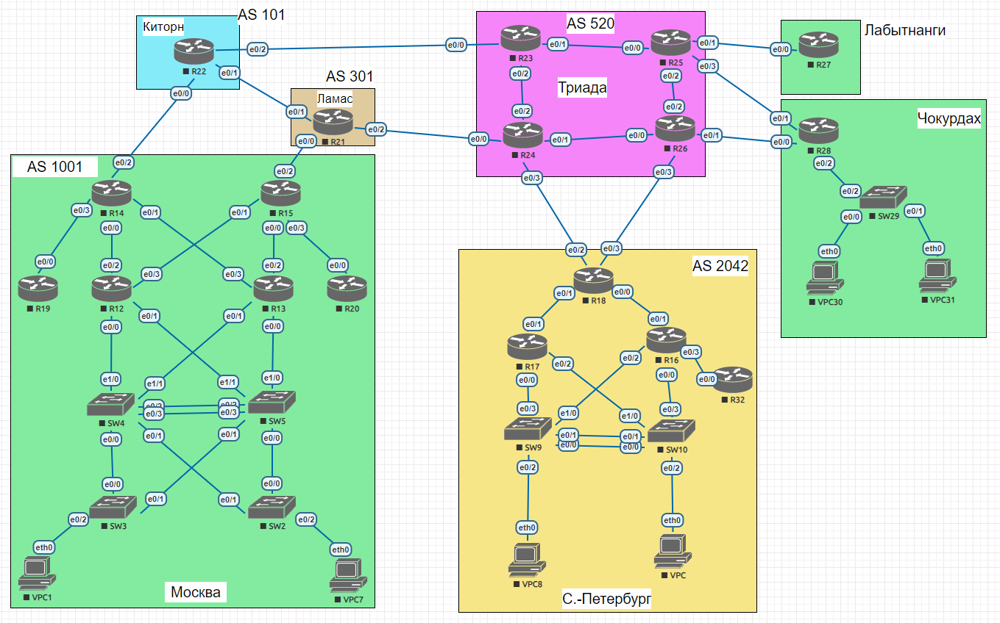

# Маршрутизация на основе политик (PBR)

### Выполнение

Лаботаторная схема сети


1. Настраиваем необходимые маршруты:
   ```
   R25# show running-config | section ip route
   ip route 10.70.101.0 255.255.255.0 10.0.0.18
   ip route 10.70.102.0 255.255.255.0 10.0.0.18

   R26# show running-config | section ip route
   ip route 10.70.101.0 255.255.255.0 10.0.0.20
   ip route 10.70.102.0 255.255.255.0 10.0.0.20

   R27# show running-config | section ip route
   ip route 0.0.0.0 0.0.0.0 10.0.0.17

   R28# show running-config | section ip route
   ip route 0.0.0.0 0.0.0.0 10.0.0.21
   ```
2. Распределим трафик между двумя линками на R28
   ```
   Ethernet0/0 link-to-R26 10.0.0.20/31 
   Ethernet0/1 link-to-R25 10.0.0.18/31
   
   R28# show running-config | section ip route
   ip route 0.0.0.0 0.0.0.0 10.0.0.21
   ```
   отмечу, что указанный маршрут отправляет трафик всех сетей через Ethernet0/0, в сторону R26, для распределения трафика между линками создадим ip prefix-list, route-map и повесим его на интерфейс 
   ```
   ip prefix-list 10.70.101.0/24 seq 5 permit 10.70.101.0/24
   
   route-map rm1 permit 5
   match ip address prefix-list 10.70.101.0/24
   set ip next-hop verify-availability 10.0.0.19 5 track 1
   
   interface Ethernet0/2.101
   description int-for-VPC30
   encapsulation dot1Q 101
   ip address 10.70.101.1 255.255.255.0
   ip policy route-map rm1
   ```
   в котором укажем направление прохождения трафика для сети 10.70.101.0/24 через Ethernet0/1, в сторону R25, для проверки работы сделаем трассировку с кадого VPC
   ```
   VPCS30> trace 8.8.8.8
   trace to 8.8.8.8, 8 hops max, press Ctrl+C to stop
   1   10.70.101.1   0.818 ms  0.800 ms  0.757 ms
   2   10.0.0.19   1.130 ms  1.208 ms  1.201 ms
   3   *10.0.0.19   0.935 ms (ICMP type:3, code:1, Destination host unreachable)  *

   VPCS31> trace 8.8.8.8
   trace to 8.8.8.8, 8 hops max, press Ctrl+C to stop
   1   10.70.102.1   0.739 ms  0.630 ms  0.717 ms
   2   10.0.0.21   1.086 ms  0.973 ms  1.233 ms
   3   *10.0.0.21   1.029 ms (ICMP type:3, code:1, Destination host unreachable)  *
   ```
3. Для отслеживания линков на R28 настроим, запустим и проверим работу IP SLA 
   ```
   ip sla 1
   icmp-echo 10.0.0.19 source-interface Ethernet0/1
   frequency 10
   ip sla schedule 1 life forever start-time now
   
   ip sla 2
   icmp-echo 10.0.0.21 source-interface Ethernet0/0
   frequency 10
   ip sla schedule 2 life forever start-time now
   
   R28# show ip sla summary
   IPSLAs Latest Operation Summary
   Codes: * active, ^ inactive, ~ pending
   
   ID           Type        Destination       Stats       Return      Last
   (ms)        Code        Run
   -----------------------------------------------------------------------
   *1           icmp-echo   10.0.0.19         RTT=1       OK          6 seconds ago
   
   
   
   
   *2           icmp-echo   10.0.0.21         RTT=1       OK          6 seconds ago

   ```
   проверим корректность работы IP SLA выключив интерфейс Ethernet0/0, проверим значения
   ```
   R28(config)#interface e0/0
   R28(config-if)#shutdown
   *Jan 27 13:07:29.008: %LINK-5-CHANGED: Interface Ethernet0/0, changed state to administratively down
   *Jan 27 13:07:29.022: %SYS-5-CONFIG_I: Configured from console by console
   *Jan 27 13:07:30.012: %LINEPROTO-5-UPDOWN: Line protocol on Interface Ethernet0/0, changed state to down

   R28#show ip sla summary
   IPSLAs Latest Operation Summary
   Codes: * active, ^ inactive, ~ pending
   
   ID           Type        Destination       Stats       Return      Last
   (ms)        Code        Run
   -----------------------------------------------------------------------
   *1           icmp-echo   10.0.0.19         RTT=1       OK          5 seconds ago
   
   
   
   
   *2           icmp-echo   10.0.0.21         -           Timeout     15 seconds ago
   ```