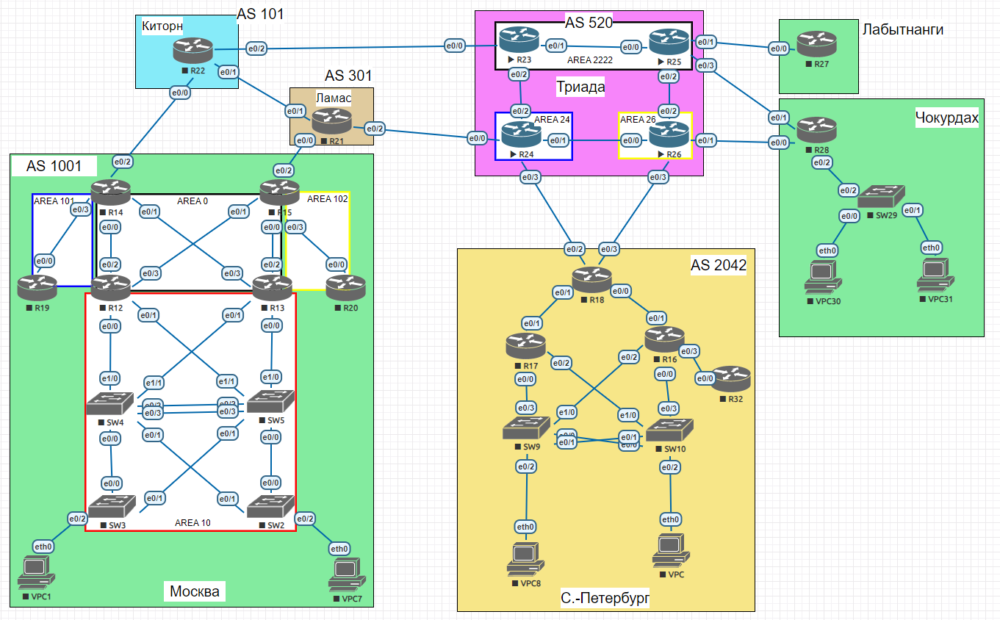

# IS-IS.

### Выполнение

Лаботаторная схема сети


1. Отобразим на схеме пункты задания относительно принадлежности зон.
2. Настроим зоны зоны и интерфейсы для роутеров R23,R24,R25,R26 согласно задания.
   ```
   R23 зона 2222:
   router isis
   net 49.2222.0023.0023.0023.00

   R24 зона 24:
   router isis
   net 49.0024.0024.0024.0024.00
   is-type level-2-only

   R25 зона 2222:
   router isis
   net 49.2222.0025.0025.0025.00

   R26 зона 26:
   router isis
   net 49.0026.0026.0026.0026.00
   is-type level-2-only
   
   На интерфейсах:
   ip router isis 
   ```
   Проверим соседство:
   ```
   R23# show isis neighbors
   System Id      Type Interface   IP Address      State Holdtime Circuit Id
   R24            L2   Et0/2       10.50.2.2       UP    8        R24.02
   R25            L1   Et0/1       10.50.2.4       UP    7        R25.01
   R25            L2   Et0/1       10.50.2.4       UP    8        R25.01
    
   R24# show isis neighbors
   System Id      Type Interface   IP Address      State Holdtime Circuit Id
   R23            L2   Et0/2       10.50.2.3       UP    25       R24.02
   R26            L2   Et0/1       10.50.2.6       UP    8        R26.01
    
   R25# show isis neighbors
   System Id      Type Interface   IP Address      State Holdtime Circuit Id
   R23            L1   Et0/0       10.50.2.5       UP    24       R25.01
   R23            L2   Et0/0       10.50.2.5       UP    22       R25.01
   R26            L2   Et0/2       10.50.2.8       UP    8        R26.02
    
   R26# show isis neighbors
   System Id      Type Interface   IP Address      State Holdtime Circuit Id
   R24            L2   Et0/0       10.50.2.7       UP    28       R26.01
   R25            L2   Et0/2       10.50.2.9       UP    26       R26.02
   ```
   Проверим таблицы маршрутизации:
   ```
    R23# show ip route isis
         10.0.0.0/8 is variably subnetted, 12 subnets, 2 masks
   i L2     10.50.0.24/32 [115/20] via 10.50.2.2, 00:41:24, Ethernet0/2
   i L1     10.50.0.25/32 [115/20] via 10.50.2.4, 00:51:11, Ethernet0/1
   i L2     10.50.0.26/32 [115/30] via 10.50.2.4, 00:40:58, Ethernet0/1
                          [115/30] via 10.50.2.2, 00:40:58, Ethernet0/2
   i L2     10.50.2.6/31 [115/20] via 10.50.2.2, 00:41:24, Ethernet0/2
   i L1     10.50.2.8/31 [115/20] via 10.50.2.4, 00:51:11, Ethernet0/1
    
   R24# show ip route isis
         10.0.0.0/8 is variably subnetted, 14 subnets, 2 masks
   i L2     10.50.0.23/32 [115/20] via 10.50.2.3, 00:42:54, Ethernet0/2
   i L2     10.50.0.25/32 [115/30] via 10.50.2.6, 00:42:28, Ethernet0/1
                          [115/30] via 10.50.2.3, 00:42:28, Ethernet0/2
   i L2     10.50.0.26/32 [115/20] via 10.50.2.6, 00:42:28, Ethernet0/1
   i L2     10.50.2.4/31 [115/20] via 10.50.2.3, 00:42:54, Ethernet0/2
   i L2     10.50.2.8/31 [115/20] via 10.50.2.6, 00:42:28, Ethernet0/1
    
   R25# show ip route isis
         10.0.0.0/8 is variably subnetted, 16 subnets, 3 masks
   i L1     10.50.0.23/32 [115/20] via 10.50.2.5, 00:53:42, Ethernet0/0
   i L2     10.50.0.24/32 [115/30] via 10.50.2.8, 00:43:07, Ethernet0/2
                          [115/30] via 10.50.2.5, 00:43:07, Ethernet0/0
   i L2     10.50.0.26/32 [115/20] via 10.50.2.8, 00:43:07, Ethernet0/2
   i L1     10.50.2.2/31 [115/20] via 10.50.2.5, 00:53:42, Ethernet0/0
   i L2     10.50.2.6/31 [115/20] via 10.50.2.8, 00:43:07, Ethernet0/2
    
   R26# show ip route isis
         10.0.0.0/8 is variably subnetted, 16 subnets, 3 masks
   i L2     10.50.0.23/32 [115/30] via 10.50.2.9, 00:43:39, Ethernet0/2
                          [115/30] via 10.50.2.7, 00:43:39, Ethernet0/0
   i L2     10.50.0.24/32 [115/20] via 10.50.2.7, 00:43:39, Ethernet0/0
   i L2     10.50.0.25/32 [115/20] via 10.50.2.9, 00:43:39, Ethernet0/2
   i L2     10.50.2.2/31 [115/20] via 10.50.2.7, 00:43:39, Ethernet0/0
   i L2     10.50.2.4/31 [115/20] via 10.50.2.9, 00:43:39, Ethernet0/2
    
    ```