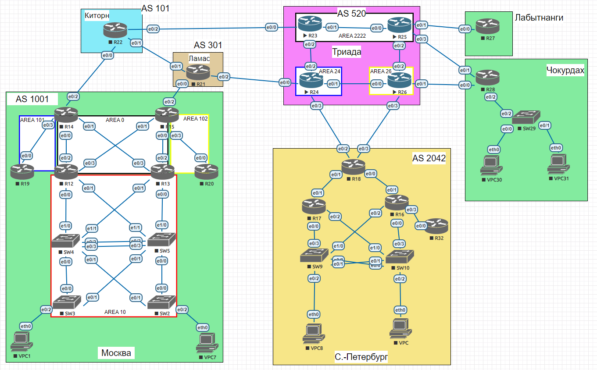

# EIGRP

### Выполнение

Лаботаторная схема сети


1. Произведем настройку EIGRP Named Mode на R16, R17, R18, R32
```
R16
!
router eigrp named
 !
 address-family ipv4 unicast autonomous-system 2
  !
  af-interface Ethernet0/1
   summary-address 10.20.2.0 255.255.255.0
   summary-address 10.20.100.0 255.255.252.0
  exit-af-interface
  !
  af-interface Ethernet0/0
   passive-interface
  exit-af-interface
  !
  af-interface Ethernet0/2
   passive-interface
  exit-af-interface
  !
  topology base
   distribute-list prefix sum_default_ipv4 out Ethernet0/3
  exit-af-topology
  network 10.20.0.0 0.0.255.255
  eigrp router-id 16.16.16.16
 exit-address-family
 !
 address-family ipv6 unicast autonomous-system 2
  !
  af-interface Ethernet0/1
   summary-address FD00::10:20:100:0/104
   summary-address FD00::10:20:2:0/112
  exit-af-interface
  !
  af-interface Ethernet0/0
   passive-interface
  exit-af-interface
  !
  af-interface Ethernet0/2
   passive-interface
  exit-af-interface
  !
  topology base
   distribute-list prefix-list sum_default_ipv6 out Ethernet0/3
  exit-af-topology
  eigrp router-id 16.16.16.16
 exit-address-family
!
ip prefix-list sum_default_ipv4 seq 10 permit 0.0.0.0/0
ipv6 prefix-list sum_default_ipv6 seq 10 permit ::/0


 
R16# show ip route eigrp
D*EX  0.0.0.0/0 [170/6144000] via 10.20.2.5, 00:12:54, Ethernet0/1
      10.0.0.0/8 is variably subnetted, 15 subnets, 4 masks
D        10.20.0.17/32 [90/1536640] via 10.20.2.5, 00:12:54, Ethernet0/1
D        10.20.0.18/32 [90/1024640] via 10.20.2.5, 00:12:54, Ethernet0/1
D        10.20.0.32/32 [90/1024640] via 10.20.2.7, 00:35:39, Ethernet0/3
D        10.20.2.0/24 is a summary, 00:12:52, Null0
D        10.20.2.2/31 [90/1536000]  via 10.20.2.5, 00:12:54, Ethernet0/1
D        10.20.100.0/22 is a summary, 00:12:52, Null0

R16# show ipv6 route eigrp
EX  ::/0 [170/6144000] via FE80::1, Ethernet0/1
D   FD00::10:20:0:17/128 [90/1536640] via FE80::1, Ethernet0/1
D   FD00::10:20:0:18/128 [90/1024640] via FE80::1, Ethernet0/1
D   FD00::10:20:0:32/128 [90/1024640] via FE80::2, Ethernet0/3
D   FD00::10:20:2:0/112 [5/1024000]   via Null0, directly connected
D   FD00::10:20:2:2/127 [90/1536000]  via FE80::1, Ethernet0/1
D   FD00::10:20:100:0/104 [5/1024000] via Null0, directly connected
```
```
R17
!
router eigrp named
 !
 address-family ipv4 unicast autonomous-system 2
  !
  af-interface Ethernet0/1
   summary-address 10.20.2.0 255.255.255.0
   summary-address 10.20.100.0 255.255.252.0
  exit-af-interface
  !
  af-interface Ethernet0/0
   passive-interface
  exit-af-interface
  !
  af-interface Ethernet0/2
   passive-interface
  exit-af-interface
  !
  topology base
  exit-af-topology
  network 10.20.0.0 0.0.255.255
  eigrp router-id 17.17.17.17
 exit-address-family
 !
 address-family ipv6 unicast autonomous-system 2
  !
  af-interface Ethernet0/1
   summary-address FD00::10:20:100:0/104
   summary-address FD00::10:20:2:0/112
  exit-af-interface
  !
  af-interface Ethernet0/0
   passive-interface
  exit-af-interface
  !
  af-interface Ethernet0/2
   passive-interface
  exit-af-interface
  !
  topology base
  exit-af-topology
  eigrp router-id 17.17.17.17
 exit-address-family

R17# show ip route eigrp
D*EX  0.0.0.0/0 [170/6144000] via 10.20.2.3, 00:45:41, Ethernet0/1
      10.0.0.0/8 is variably subnetted, 13 subnets, 4 masks
D        10.20.0.16/32 [90/1536640] via 10.20.2.3, 00:22:46, Ethernet0/1
D        10.20.0.18/32 [90/1024640] via 10.20.2.3, 00:45:41, Ethernet0/1
D        10.20.0.32/32 [90/2048640] via 10.20.2.3, 00:22:46, Ethernet0/1
D        10.20.2.0/24 is a summary, 00:27:23, Null0
D        10.20.2.4/31 [90/1536000]  via 10.20.2.3, 00:45:41, Ethernet0/1
D        10.20.100.0/22 is a summary, 00:25:51, Null0

R17# show ipv6 route eigrp
EX  ::/0 [170/6144000] via FE80::1, Ethernet0/1
D   FD00::10:20:0:16/128 [90/1536640] via FE80::1, Ethernet0/1
D   FD00::10:20:0:18/128 [90/1024640] via FE80::1, Ethernet0/1
D   FD00::10:20:0:32/128 [90/2048640] via FE80::1, Ethernet0/1
D   FD00::10:20:2:0/112 [5/1024000]   via Null0, directly connected
D   FD00::10:20:2:4/127 [90/1536000]  via FE80::1, Ethernet0/1
D   FD00::10:20:100:0/104 [5/1024000] via Null0, directly connected
```
```
R18
!
router eigrp named
 !
 address-family ipv4 unicast autonomous-system 2
  !
  topology base
   redistribute static metric 100000 1000 255 1 1500
  exit-af-topology
  network 10.20.0.0 0.0.255.255
  eigrp router-id 18.18.18.18
 exit-address-family
 !
 address-family ipv6 unicast autonomous-system 2
  !
  topology base
   redistribute static metric 100000 1000 255 1 1500
  exit-af-topology
  eigrp router-id 18.18.18.18
 exit-address-family
!
ip route 0.0.0.0 0.0.0.0 Null0
!
ipv6 route ::/0 Null0

R18# show ip route eigrp
D        10.20.0.16/32 [90/1024640]  via 10.20.2.4, 00:27:38, Ethernet0/0
D        10.20.0.17/32 [90/1024640]  via 10.20.2.2, 00:32:45, Ethernet0/1
D        10.20.0.32/32 [90/1536640]  via 10.20.2.4, 00:27:38, Ethernet0/0
D        10.20.2.0/24 [90/1536000]   via 10.20.2.4, 00:27:38, Ethernet0/0
                      [90/1536000]   via 10.20.2.2, 00:27:38, Ethernet0/1
D        10.20.100.0/22 [90/1536000] via 10.20.2.4, 00:27:38, Ethernet0/0
                        [90/1536000] via 10.20.2.2, 00:27:38, Ethernet0/1

R18# show ipv6 route eigrp
D   FD00::10:20:0:16/128 [90/1024640]  via FE80::2, Ethernet0/0
D   FD00::10:20:0:17/128 [90/1024640]  via FE80::2, Ethernet0/1
D   FD00::10:20:0:32/128 [90/1536640]  via FE80::2, Ethernet0/0
D   FD00::10:20:2:0/112 [90/1536000]   via FE80::2, Ethernet0/1
                                       via FE80::2, Ethernet0/0
D   FD00::10:20:100:0/104 [90/1536000] via FE80::2, Ethernet0/1
                                       via FE80::2, Ethernet0/0

```
```
R32
!
router eigrp named
 !
 address-family ipv4 unicast autonomous-system 2
  !
  topology base
  exit-af-topology
  network 10.20.0.0 0.0.255.255
  eigrp router-id 32.32.32.32
 exit-address-family
 !
 address-family ipv6 unicast autonomous-system 2
  !
  topology base
  exit-af-topology
  eigrp router-id 32.32.32.32
 exit-address-family
 
R32# show ip route eigrp
D*EX  0.0.0.0/0 [170/6656000] via 10.20.2.6, 00:36:11, Ethernet0/0

R32# show ipv6 route eigrp
EX  ::/0 [170/6656000] via FE80::1, Ethernet0/0
```