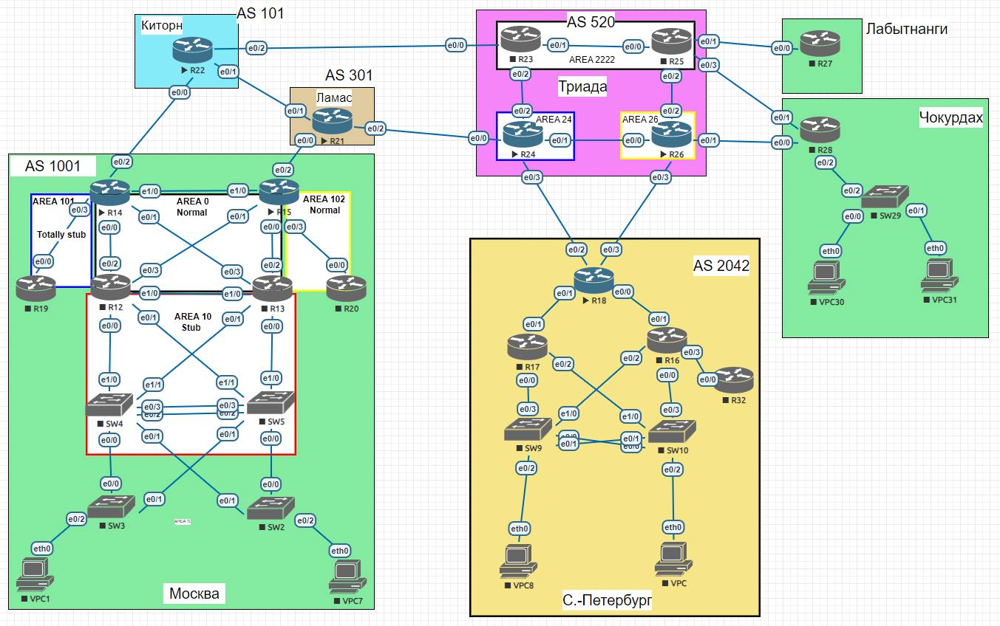

# BGP

### Выполнение

Лаботаторная схема сети


1. Настроим eBGP между офисом Москва и двумя провайдерами - Киторн и Ламас.
   
   Настроим пограничные интерфейсы на R14 и R22:
   ```
   R14# show running-config interface ethernet 0/2
   interface Ethernet0/2
   description link-to-R22-KITORN
   ip address 10.0.0.3 255.255.255.254
   ipv6 address FE80::2 link-local
   ipv6 address FD00::10:0:0:3/127
   ipv6 enable
   !
   R22# show running-config interface ethernet 0/0
   interface Ethernet0/0
   description link-to-R14-MOSKOW
   no switchport
   ip address 10.0.0.2 255.255.255.254
   duplex auto
   ipv6 address FE80::1 link-local
   ipv6 address FD00::10:0:0:2/127
   ipv6 enable
   end
   ```
   Настроим eBGP между R14 и R22:
   ```
   R14# show running-config | section bgp
   router bgp 1001
   bgp log-neighbor-changes
   neighbor 10.0.0.2 remote-as 101
   neighbor FD00::10:0:0:2 remote-as 101
   !
   address-family ipv4
   network 123.14.14.0 mask 255.255.255.0
   neighbor 10.0.0.2 activate
   no neighbor FD00::10:0:0:2 activate
   exit-address-family
   !
   address-family ipv6
   network 2001::123:14:14:0/112
   neighbor FD00::10:0:0:2 activate
   exit-address-family
   !
   R22# show running-config | section bgp
   router bgp 101
   bgp log-neighbor-changes
   neighbor 10.0.0.3 remote-as 1001
   neighbor FD00::10:0:0:3 remote-as 1001
   !
   address-family ipv4
   network 123.22.22.0 mask 255.255.255.0
   neighbor 10.0.0.3 activate
   no neighbor FD00::10:0:0:3 activate
   exit-address-family
   !
   address-family ipv6
   network 2001::123:22:22:0/112
   neighbor FD00::10:0:0:3 activate
   exit-address-family
   ```
   Проверим установление сессии eBGP:
   ```
   R14# show ip bgp ipv4 unicast summary
   Neighbor        V           AS MsgRcvd MsgSent   TblVer  InQ OutQ Up/Down  State/PfxRcd
   10.0.0.2        4          101      51      50        7    0    0 00:40:15        2
   
   R14# show ip bgp ipv6 unicast summary
   Neighbor        V           AS MsgRcvd MsgSent   TblVer  InQ OutQ Up/Down  State/PfxRcd
   FD00::10:0:0:2  4          101      37      38        3    0    0 00:30:14        1

   R22# show ip bgp ipv4 unicast summary
   Neighbor        V           AS MsgRcvd MsgSent   TblVer  InQ OutQ Up/Down  State/PfxRcd
   10.0.0.3        4         1001      51      53        6    0    0 00:41:40        3

   R22# show ip bgp ipv6 unicast summary
   Neighbor        V           AS MsgRcvd MsgSent   TblVer  InQ OutQ Up/Down  State/PfxRcd
   FD00::10:0:0:3  4         1001      39      38        4    0    0 00:31:13        1
   ```
   Для проверки связности настроим loopback 1 с ip из анонсируемых сетей
   ```
   R14# show running-config interface loopback 1
   interface Loopback1
   description REAL-IP-FOR-TEST
   ip address 123.14.14.1 255.255.255.0
   ipv6 address 2001::123:14:14:1/112
   ipv6 enable
   end
   
   R22# show running-config interface loopback 1
   interface Loopback1
   description REAL-IP-FOR-TEST
   ip address 123.22.22.1 255.255.255.0
   ipv6 address 2001::123:22:22:1/112
   ipv6 enable
   end
   ```
   Проверим доступность ip между провайдерами
   ```
   R14# ping 123.22.22.1
   Type escape sequence to abort.
   Sending 5, 100-byte ICMP Echos to 123.22.22.1, timeout is 2 seconds:
   !!!!!
   Success rate is 100 percent (5/5), round-trip min/avg/max = 1/1/1 ms
   R14# ping 2001::123:22:22:1
   Type escape sequence to abort.
   Sending 5, 100-byte ICMP Echos to 2001::123:22:22:1, timeout is 2 seconds:
   !!!!!
   Success rate is 100 percent (5/5), round-trip min/avg/max = 1/1/1 ms
   !
   R22# ping 123.14.14.1
   Type escape sequence to abort.
   Sending 5, 100-byte ICMP Echos to 123.14.14.1, timeout is 2 seconds:
   !!!!!
   Success rate is 100 percent (5/5), round-trip min/avg/max = 1/1/1 ms
   R22# ping 2001::123:14:14:1
   Type escape sequence to abort.
   Sending 5, 100-byte ICMP Echos to 2001::123:14:14:1, timeout is 2 seconds:
   !!!!!
   Success rate is 100 percent (5/5), round-trip min/avg/max = 1/1/1 ms
   ```
   По аналогии настраиваем сессии между R21 и R15 проверяем сессии, анонсы, связность:
   ```   
   R15# show ip bgp ipv4 unicast summary
   Neighbor        V           AS MsgRcvd MsgSent   TblVer  InQ OutQ Up/Down  State/PfxRcd
   10.0.0.4        4          301      18      17       10    0    0 00:10:02        2
   
   R15# show ip bgp ipv6 unicast summary
   Neighbor        V           AS MsgRcvd MsgSent   TblVer  InQ OutQ Up/Down  State/PfxRcd
   FD00::10:0:0:4  4          301      11      11        3    0    0 00:05:58        1
   
   R21# show ip bgp ipv4 unicast summary
   Neighbor        V           AS MsgRcvd MsgSent   TblVer  InQ OutQ Up/Down  State/PfxRcd
   10.0.0.5        4         1001      19      20        5    0    0 00:11:45        3

   R21# show ip bgp ipv6 unicast summary
   Neighbor        V           AS MsgRcvd MsgSent   TblVer  InQ OutQ Up/Down  State/PfxRcd
   FD00::10:0:0:5  4         1001      12      12        5    0    0 00:06:47        1

   R15# ping 123.21.21.1
   !!!!!
   Success rate is 100 percent (5/5), round-trip min/avg/max = 1/1/2 ms
   R15# ping 2001::123:21:21:1
   !
   Sending 5, 100-byte ICMP Echos to 2001::123:21:21:1, timeout is 2 seconds:
   !!!!!
   Success rate is 100 percent (5/5), round-trip min/avg/max = 1/1/1 ms
   !
   R21# ping 123.15.15.1
   Sending 5, 100-byte ICMP Echos to 123.15.15.1, timeout is 2 seconds:
   !!!!!
   Success rate is 100 percent (5/5), round-trip min/avg/max = 1/1/1 ms
   R21# ping 2001::123:15:15:1
   !
   Sending 5, 100-byte ICMP Echos to 2001::123:15:15:1, timeout is 2 seconds:
   !!!!!
   Success rate is 100 percent (5/5), round-trip min/avg/max = 1/1/1 ms
   ```
2. Настроим eBGP между провайдерами Киторн и Ламас.
   По аналогии настраиваем сессии между R22 и R21 проверяем сессии, анонсы, связность:
   ```
   R22# show ip bgp ipv4 unicast summary
   Neighbor        V           AS MsgRcvd MsgSent   TblVer  InQ OutQ Up/Down  State/PfxRcd
   10.0.0.3        4         1001     122     129        9    0    0 01:44:29        3
   10.0.0.12       4          301      47      49        9    0    0 00:36:17        3
   
   R22# show ip bgp ipv6 unicast summary
   Neighbor        V           AS MsgRcvd MsgSent   TblVer  InQ OutQ Up/Down  State/PfxRcd
   FD00::10:0:0:3  4         1001     109     111       10    0    0 01:34:03        1
   FD00::10:0:0:12 4          301      17      14       10    0    0 00:03:33        2

   R21# show ip bgp ipv4 unicast summary
   Neighbor        V           AS MsgRcvd MsgSent   TblVer  InQ OutQ Up/Down  State/PfxRcd
   10.0.0.5        4         1001      48      48        5    0    0 00:37:19        3
   10.0.0.13       4          101      50      48        5    0    0 00:37:19        3
   
   R21# show ip bgp ipv6 unicast summary
   Neighbor        V           AS MsgRcvd MsgSent   TblVer  InQ OutQ Up/Down  State/PfxRcd
   FD00::10:0:0:5  4         1001      41      46       11    0    0 00:32:20        1
   FD00::10:0:0:13 4          101      15      18       11    0    0 00:04:34        2

   R22# ping 123.21.21.1
   Sending 5, 100-byte ICMP Echos to 123.21.21.1, timeout is 2 seconds:
   !!!!!
   Success rate is 100 percent (5/5), round-trip min/avg/max = 1/1/1 ms
   
   R22# ping 2001::123:21:21:1
   Type escape sequence to abort.
   Sending 5, 100-byte ICMP Echos to 2001::123:21:21:1, timeout is 2 seconds:
   !!!!!
   Success rate is 100 percent (5/5), round-trip min/avg/max = 1/1/1 ms

   R21# ping 123.22.22.1
   Sending 5, 100-byte ICMP Echos to 123.22.22.1, timeout is 2 seconds:
   !!!!!
   Success rate is 100 percent (5/5), round-trip min/avg/max = 1/1/5 ms
   
   R21# ping 2001::123:22:22:1
   Sending 5, 100-byte ICMP Echos to 2001::123:22:22:1, timeout is 2 seconds:
   !!!!!
   Success rate is 100 percent (5/5), round-trip min/avg/max = 1/1/1 ms
   ```
3. Настроим eBGP между Ламас и Триада
   По аналогии настраиваем сессии между R24 и R21 проверяем сессии, анонсы, связность:
   ```
   R21# show ip bgp ipv4 unicast summary
   Neighbor        V           AS MsgRcvd MsgSent   TblVer  InQ OutQ Up/Down  State/PfxRcd
   10.0.0.5        4         1001     122     122       10    0    0 01:42:20        3
   10.0.0.13       4          101     123     123       10    0    0 01:42:20        3
   10.0.0.14       4          520      42      49       10    0    0 00:34:42        1
   
   R21# show ip bgp ipv6 unicast summary
   Neighbor        V           AS MsgRcvd MsgSent   TblVer  InQ OutQ Up/Down  State/PfxRcd
   FD00::10:0:0:5  4         1001     113     128       23    0    0 01:37:29        1
   FD00::10:0:0:13 4          101      93      99       23    0    0 01:09:43        2
   FD00::10:0:0:14 4          520      42      52       23    0    0 00:34:54        1

   R24# show ip bgp ipv4 unicast summary
   Neighbor        V           AS MsgRcvd MsgSent   TblVer  InQ OutQ Up/Down  State/PfxRcd
   10.0.0.15       4          301      51      44        7    0    0 00:36:36        4
   
   R24# show ip bgp ipv6 unicast summary
   Neighbor        V           AS MsgRcvd MsgSent   TblVer  InQ OutQ Up/Down  State/PfxRcd
   FD00::10:0:0:15 4          301      54      44        6    0    0 00:36:42        4

   R21# ping 123.24.24.1
   Sending 5, 100-byte ICMP Echos to 123.24.24.1, timeout is 2 seconds:
   !!!!!
   Success rate is 100 percent (5/5), round-trip min/avg/max = 1/1/1 ms
   
   R21# ping 2001::123:24:24:1
   Sending 5, 100-byte ICMP Echos to 2001::123:24:24:1, timeout is 2 seconds:
   !!!!!
   Success rate is 100 percent (5/5), round-trip min/avg/max = 1/1/1 ms

   R24# ping 123.21.21.1
   Sending 5, 100-byte ICMP Echos to 123.21.21.1, timeout is 2 seconds:
   !!!!!
   Success rate is 100 percent (5/5), round-trip min/avg/max = 1/1/1 ms
   
   R24# ping 2001::123:21:21:1
   Sending 5, 100-byte ICMP Echos to 2001::123:21:21:1, timeout is 2 seconds:
   !!!!!
   Success rate is 100 percent (5/5), round-trip min/avg/max = 1/1/1 ms
   ```
4. Настроим eBGP между офисом С.-Петербург и провайдером Триада.
   По аналогии настраиваем сессии между R24 и R18 проверяем сессии, анонсы, связность:
   ```
   R18# show ip bgp ipv4 unicast summary
   Neighbor        V           AS MsgRcvd MsgSent   TblVer  InQ OutQ Up/Down  State/PfxRcd
   10.0.0.6        4          520      20      15        7    0    0 00:09:50        5
   
   R18# show ip bgp ipv6 unicast summary
   Neighbor        V           AS MsgRcvd MsgSent   TblVer  InQ OutQ Up/Down  State/PfxRcd
   FD00::10:0:0:6  4          520      17      11        7    0    0 00:06:44        5

   R24# show ip bgp ipv4 unicast summary
   Neighbor        V           AS MsgRcvd MsgSent   TblVer  InQ OutQ Up/Down  State/PfxRcd
   10.0.0.7        4         2042      16      21        7    0    0 00:11:12        1
   10.0.0.15       4          301      35      32        7    0    0 00:24:44        4
   
   R24# show ip bgp ipv6 unicast summary
   Neighbor        V           AS MsgRcvd MsgSent   TblVer  InQ OutQ Up/Down  State/PfxRcd
   FD00::10:0:0:7  4         2042      13      19        7    0    0 00:08:10        1
   FD00::10:0:0:15 4          301      35      31        7    0    0 00:24:51        4

   R18# ping 123.24.24.1
   Sending 5, 100-byte ICMP Echos to 123.24.24.1, timeout is 2 seconds:
   !!!!!
   Success rate is 100 percent (5/5), round-trip min/avg/max = 1/1/2 ms
   
   R18# ping 2001::123:24:24:1
   Sending 5, 100-byte ICMP Echos to 2001::123:24:24:1, timeout is 2 seconds:
   !!!!!
   Success rate is 100 percent (5/5), round-trip min/avg/max = 1/1/1 ms

   R24# ping 123.18.18.1
   Sending 5, 100-byte ICMP Echos to 123.18.18.1, timeout is 2 seconds:
   !!!!!
   Success rate is 100 percent (5/5), round-trip min/avg/max = 1/1/2 ms
   
   R24# ping 2001::123:18:18:1
   Sending 5, 100-byte ICMP Echos to 2001::123:18:18:1, timeout is 2 seconds:
   !!!!!
   Success rate is 100 percent (5/5), round-trip min/avg/max = 1/1/1 ms
   ```
5. Организуем IP доступность между пограничным роутерами офисами Москва и С.-Петербург.
   Проверим доступность между роутерами R14, R15 (Москва) и R18 (Петербург)
   ```
   R18# ping 123.14.14.1 source l1
   Sending 5, 100-byte ICMP Echos to 123.14.14.1, timeout is 2 seconds:
   Packet sent with a source address of 123.18.18.1
   !!!!!
   Success rate is 100 percent (5/5), round-trip min/avg/max = 1/2/5 ms

   R18# ping 2001::123:14:14:1 source l1
   Sending 5, 100-byte ICMP Echos to 2001::123:14:14:1, timeout is 2 seconds:
   Packet sent with a source address of 2001::123:18:18:1
   !!!!!
   Success rate is 100 percent (5/5), round-trip min/avg/max = 1/1/2 ms

   R18# ping 123.15.15.1 source l1
   Sending 5, 100-byte ICMP Echos to 123.15.15.1, timeout is 2 seconds:
   Packet sent with a source address of 123.18.18.1
   !!!!!
   Success rate is 100 percent (5/5), round-trip min/avg/max = 1/1/2 ms
   
   R18# ping 2001::123:15:15:1 source l1
   Sending 5, 100-byte ICMP Echos to 2001::123:15:15:1, timeout is 2 seconds:
   Packet sent with a source address of 2001::123:18:18:1
   !!!!!
   Success rate is 100 percent (5/5), round-trip min/avg/max = 1/1/2 ms
   ```