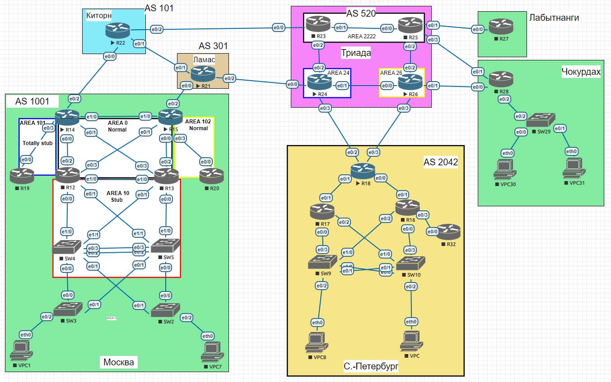

# iBGP

### Выполнение

Лаботаторная схема сети


1. Настроим iBGP в офисе Москва между маршрутизаторами R14 и R15.
   ```
   R14# sh run | sec bgp
   router bgp 1001
   bgp log-neighbor-changes
   neighbor 10.10.0.15 remote-as 1001
   neighbor 10.10.0.15 update-source Loopback0
   neighbor FD00::10:10:0:15 remote-as 1001
   neighbor FD00::10:10:0:15 update-source Loopback0
   !
   address-family ipv4
   network 123.14.14.0 mask 255.255.255.0
   neighbor 10.10.0.15 activate
   neighbor 10.10.0.15 next-hop-self
   no neighbor FD00::10:0:0:2 activate
   no neighbor FD00::10:10:0:15 activate
   exit-address-family
   !
   address-family ipv6
   network 2001::123:14:14:0/112
   neighbor FD00::10:10:0:15 activate
   neighbor FD00::10:10:0:15 next-hop-self
   exit-address-family
   
   R15# sh run | sec bgp
   router bgp 1001
   neighbor 10.10.0.14 remote-as 1001
   neighbor 10.10.0.14 update-source Loopback0
   neighbor FD00::10:10:0:14 remote-as 1001
   neighbor FD00::10:10:0:14 update-source Loopback0
   !
   address-family ipv4
   network 123.15.15.0 mask 255.255.255.0
   neighbor 10.10.0.14 activate
   neighbor 10.10.0.14 next-hop-self
   no neighbor FD00::10:10:0:14 activate
   exit-address-family
   !
   address-family ipv6
   network 2001::123:15:15:0/112
   neighbor FD00::10:10:0:14 activate
   neighbor FD00::10:10:0:14 next-hop-self
   exit-address-family

   R14# sh ip bgp ipv4 unicast summary
   Neighbor        V           AS MsgRcvd MsgSent   TblVer  InQ OutQ Up/Down  State/PfxRcd
   10.10.0.15      4         1001      52      51        6    0    0 00:41:26        2

   R14# sh ip bgp ipv6 unicast summary
   Neighbor          V           AS MsgRcvd MsgSent   TblVer  InQ OutQ Up/Down  State/PfxRcd
   FD00::10:10:0:15  4         1001      17      20        7    0    0 00:06:55        2
   ```
2. Настроим iBGP в провайдере Триада, с использованием RR (в качестве RR выступает R24).
   ```
   R24# sh run | sec bgp
   router bgp 520
   bgp log-neighbor-changes
   neighbor TRIADA_ipv4 peer-group
   neighbor TRIADA_ipv4 remote-as 520
   neighbor TRIADA_ipv4 update-source Loopback0
   neighbor TRIADA_ipv6 peer-group
   neighbor TRIADA_ipv6 remote-as 520
   neighbor TRIADA_ipv6 update-source Loopback0
   neighbor 10.0.0.7 remote-as 2042
   neighbor 10.0.0.15 remote-as 301
   neighbor 10.50.0.23 peer-group TRIADA_ipv4
   neighbor 10.50.0.25 peer-group TRIADA_ipv4
   neighbor 10.50.0.26 peer-group TRIADA_ipv4
   neighbor FD00::10:0:0:7 remote-as 2042
   neighbor FD00::10:0:0:15 remote-as 301
   neighbor FD00::10:50:0:23 peer-group TRIADA_ipv6
   neighbor FD00::10:50:0:25 peer-group TRIADA_ipv6
   neighbor FD00::10:50:0:26 peer-group TRIADA_ipv6
   !
   address-family ipv4
   network 123.24.24.0 mask 255.255.255.0
   neighbor TRIADA_ipv4 route-reflector-client
   neighbor TRIADA_ipv4 next-hop-self
   neighbor 10.0.0.7 activate
   neighbor 10.0.0.15 activate
   neighbor 10.50.0.23 activate
   neighbor 10.50.0.25 activate
   neighbor 10.50.0.26 activate
   no neighbor FD00::10:0:0:7 activate
   no neighbor FD00::10:0:0:15 activate
   no neighbor FD00::10:50:0:23 activate
   no neighbor FD00::10:50:0:25 activate
   no neighbor FD00::10:50:0:26 activate
   exit-address-family
   !
   address-family ipv6
   network 2001::123:24:24:0/112
   neighbor TRIADA_ipv6 route-reflector-client
   neighbor TRIADA_ipv6 next-hop-self
   neighbor FD00::10:0:0:7 activate
   neighbor FD00::10:0:0:15 activate
   neighbor FD00::10:50:0:23 activate
   neighbor FD00::10:50:0:25 activate
   neighbor FD00::10:50:0:26 activate
   exit-address-family

   R24# show ip bgp ipv4 unicast summary
   Neighbor        V           AS MsgRcvd MsgSent   TblVer  InQ OutQ Up/Down  State/PfxRcd
   10.50.0.23      4          520       2       2        1    0    0 00:00:05        0
   10.50.0.25      4          520       2       2        1    0    0 00:00:07        0
   10.50.0.26      4          520       2       2        1    0    0 00:00:08        0

   R24# show ip bgp ipv6 unicast summary
   Neighbor          V           AS MsgRcvd MsgSent   TblVer  InQ OutQ Up/Down  State/PfxRcd
   FD00::10:50:0:23  4          520       2       7        3    0    0 00:00:46        0
   FD00::10:50:0:25  4          520       5       5        3    0    0 00:00:47        1
   FD00::10:50:0:26  4          520       2       7        3    0    0 00:00:46        0

   R24# sh ip bgp update-group
   BGP version 4 update-group 1, internal, Address Family: IPv4 Unicast
   BGP Update version : 5/0, messages 0
   Route-Reflector Client
   NEXT_HOP is always this router for eBGP paths
   Topology: global, highest version: 5, tail marker: 5
   Format state: Current working (OK, last not in list)
   Refresh blocked (not in list, last not in list)
   Update messages formatted 4, replicated 12, current 0, refresh 0, limit 1000
   Number of NLRIs in the update sent: max 1, min 0
   Minimum time between advertisement runs is 0 seconds
   Has 3 members:
   10.50.0.23       10.50.0.25       10.50.0.26
   ```
3. Настройте офиса Москва так, чтобы приоритетным провайдером стал Ламас.
   ```
   Проверяем до изменения local-preference:
   R14# sh ip bgp
        Network          Next Hop            Metric LocPrf Weight Path
   r>i 123.21.21.0/24   10.10.0.15               0    100      0 301 i
   r                    10.0.0.2                               0 101 301 i
   *>  123.22.22.0/24   10.0.0.2                 0             0 101 i

   Увеличим приоритет исходящего трафика в сторону Ламас с R15: 
   router bgp 1001
   bgp log-neighbor-changes
   neighbor 10.0.0.4 remote-as 301
   neighbor FD00::10:0:0:4 remote-as 301
   !
   address-family ipv4
   network 123.15.15.0 mask 255.255.255.0
   neighbor 10.0.0.4 activate
   neighbor 10.0.0.4 route-map lp_x2 in
   no neighbor FD00::10:0:0:4 activate
   exit-address-family
   !
   address-family ipv6
   network 2001::123:15:15:0/112
   neighbor FD00::10:0:0:4 activate
   neighbor FD00::10:0:0:4 route-map lp_x2 in
   exit-address-family
   !
   route-map lp_x2 permit 10
   set local-preference 200
   
   Проверяем после изменения local-preference:
   R14#sh ip bgp
     Network          Next Hop            Metric LocPrf Weight Path
   r>i 123.21.21.0/24   10.10.0.15               0    200      0 301 i
   r                    10.0.0.2                               0 101 301 i
   r>i 123.22.22.0/24   10.10.0.15               0    200      0 301 101 i
   r                    10.0.0.2                 0             0 101 i

   Уменьшим приоритет входящего трафика со стороны Киторн в R14:
   R14# sh run | sec bgp
   router bgp 1001
   bgp log-neighbor-changes
   neighbor 10.0.0.2 remote-as 101
   neighbor 10.10.0.15 remote-as 1001
   !
   address-family ipv4
   network 123.14.14.0 mask 255.255.255.0
   neighbor 10.0.0.2 activate
   neighbor 10.0.0.2 route-map kitorn-3p out
   no neighbor FD00::10:0:0:2 activate
   exit-address-family
   !
   address-family ipv6
   network 2001::123:14:14:0/112
   neighbor FD00::10:0:0:2 activate
   neighbor FD00::10:0:0:2 route-map kitorn-3p out
   exit-address-family
   !
   route-map kitorn-3p permit 10
   set as-path prepend 1001 1001 1001

   R22# sh ip bgp
     Network          Next Hop            Metric LocPrf Weight Path
   *   123.14.14.0/24   10.0.0.10                              0 520 301 1001 i
   *>                   10.0.0.12                              0 301 1001 i
   *                    10.0.0.3                 0             0 1001 1001 1001 1001 i
   *   123.15.15.0/24   10.0.0.10                              0 520 301 1001 i
   *                    10.0.0.3                               0 1001 1001 1001 1001 i
   *>                   10.0.0.12                              0 301 1001 i
   *   123.21.21.0/24   10.0.0.3                               0 1001 1001 1001 1001 301 i
   *                    10.0.0.10                              0 520 301 i
   *>                   10.0.0.12                0             0 301 i
   *>  123.22.22.0/24   0.0.0.0                  0         32768 i
   ```
4. Настроим офис С.-Петербург так, чтобы трафик до любого офиса распределялся по двум линкам одновременно.
   ```
   Добавляем maximum-paths в нашем случае 2 для распределения трафика:
   
   router bgp 2042
   bgp log-neighbor-changes
   neighbor 10.0.0.6 remote-as 520
   neighbor 10.0.0.8 remote-as 520
   neighbor FD00::10:0:0:6 remote-as 520
   neighbor FD00::10:0:0:8 remote-as 520
   !
   address-family ipv4
   network 123.18.18.0 mask 255.255.255.0
   neighbor 10.0.0.6 activate
   neighbor 10.0.0.8 activate
   no neighbor FD00::10:0:0:6 activate
   no neighbor FD00::10:0:0:8 activate
   maximum-paths 2
   exit-address-family
   !
   address-family ipv6
   maximum-paths 2
   network 2001::123:18:18:0/112
   neighbor FD00::10:0:0:6 activate
   neighbor FD00::10:0:0:8 activate
   exit-address-family
   ```
5. Все сети в лабораторной работе имеют IP связность.
   ```
   R14# ping 123.22.22.1 source l1
   Type escape sequence to abort.
   Sending 5, 100-byte ICMP Echos to 123.22.22.1, timeout is 2 seconds:
   Packet sent with a source address of 123.14.14.1
   !!!!!
   Success rate is 100 percent (5/5), round-trip min/avg/max = 2/3/5 ms
   R14# ping 123.21.21.1 source l1
   Type escape sequence to abort.
   Sending 5, 100-byte ICMP Echos to 123.21.21.1, timeout is 2 seconds:
   Packet sent with a source address of 123.14.14.1
   !!!!!
   Success rate is 100 percent (5/5), round-trip min/avg/max = 1/1/2 ms
   R14# ping 123.23.23.1 source l1
   Type escape sequence to abort.
   Sending 5, 100-byte ICMP Echos to 123.23.23.1, timeout is 2 seconds:
   Packet sent with a source address of 123.14.14.1
   !!!!!
   Success rate is 100 percent (5/5), round-trip min/avg/max = 1/2/5 ms
   R14# ping 123.24.24.1 source l1
   Type escape sequence to abort.
   Sending 5, 100-byte ICMP Echos to 123.24.24.1, timeout is 2 seconds:
   Packet sent with a source address of 123.14.14.1
   !!!!!
   Success rate is 100 percent (5/5), round-trip min/avg/max = 1/1/2 ms
   R14# ping 123.25.25.1 source l1
   Type escape sequence to abort.
   Sending 5, 100-byte ICMP Echos to 123.25.25.1, timeout is 2 seconds:
   Packet sent with a source address of 123.14.14.1
   !!!!!
   Success rate is 100 percent (5/5), round-trip min/avg/max = 1/2/3 ms
   R14# ping 123.26.26.1 source l1
   Type escape sequence to abort.
   Sending 5, 100-byte ICMP Echos to 123.26.26.1, timeout is 2 seconds:
   Packet sent with a source address of 123.14.14.1
   !!!!!
   Success rate is 100 percent (5/5), round-trip min/avg/max = 1/2/4 ms
   R14# ping 123.18.18.1 source l1
   Type escape sequence to abort.
   Sending 5, 100-byte ICMP Echos to 123.18.18.1, timeout is 2 seconds:
   Packet sent with a source address of 123.14.14.1
   !!!!!
   Success rate is 100 percent (5/5), round-trip min/avg/max = 2/2/2 ms
   ```