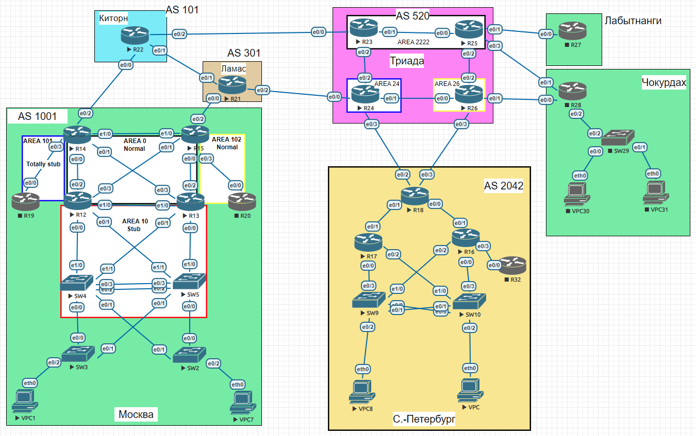

# BGP. Управление анонсами

### Выполнение

Лаботаторная схема сети


1. Настроить фильтрацию в офисе Москва так, чтобы не появилось транзитного трафика(As-path).
   ####
   Создаем access-list разрешающий только собственные префиксы, применяем на R14 и R15 в сторону uplinks.
   ```
   ip as-path access-list 1 permit ^$
   !
   router bgp 1001
   ...
      neighbor 123.22.22.2 filter-list 5 out
   ```
   До применения:
   ```
   14# show ip bgp neighbors 123.22.22.2 advertised-routes
       Network          Next Hop            Metric LocPrf Weight Path
   *>  123.14.14.0/24   0.0.0.0                  0         32768 i
   *>i 123.15.15.0/24   10.10.0.15               0    100      0 i
   *>i 123.18.18.0/24   10.10.0.15               0    200      0 301 520 2042 i
   *>i 123.21.21.0/24   10.10.0.15               0    200      0 301 i
   *>i 123.22.22.0/24   10.10.0.15               0    200      0 301 101 i
   *>i 123.23.23.0/24   10.10.0.15               0    200      0 301 520 i
   *>i 123.24.24.0/24   10.10.0.15               0    200      0 301 520 i
   *>i 123.25.25.0/24   10.10.0.15               0    200      0 301 520 i
   *>i 123.26.26.0/24   10.10.0.15               0    200      0 301 520 i
   ```
   После применения:
   ```
   R14# show ip bgp neighbors 123.22.22.2 advertised-routes
       Network          Next Hop            Metric LocPrf Weight Path
   *>  123.14.14.0/24   0.0.0.0                  0         32768 i
   *>i 123.15.15.0/24   10.10.0.15               0    100      0 i
   ```
2. Настроить фильтрацию в офисе С.-Петербург так, чтобы не появилось транзитного трафика(Prefix-list).
   ####
   Создаем prefix-list с собственными префиксами, применяем на R18 в сторону uplinks.
   ```
   ip prefix-list DENY_TRANSIT seq 5 permit 123.18.18.0/24
   !
   router bgp 2042
   ...
     neighbor 123.24.24.6 prefix-list DENY_TRANSIT out
     neighbor 123.26.26.8 prefix-list DENY_TRANSIT out
   ```
   До применения:
   ```
   R18# sh ip bgp neighbors 123.24.24.6 advertised-routes
       Network          Next Hop            Metric LocPrf Weight Path
   *>  123.14.14.0/24   123.26.26.8                            0 520 301 1001 i
   *>  123.15.15.0/24   123.24.24.6                            0 520 301 1001 i
   *>  123.18.18.0/24   0.0.0.0                  0         32768 i
   *>  123.21.21.0/24   123.24.24.6                            0 520 301 i
   *>  123.22.22.0/24   123.24.24.6                            0 520 101 i
   *>  123.23.23.0/24   123.24.24.6                            0 520 i
   *>  123.24.24.0/24   123.24.24.6              0             0 520 i
   *>  123.25.25.0/24   123.24.24.6                            0 520 i
   *>  123.26.26.0/24   123.24.24.6                            0 520 i
   !
   R18# sh ip bgp neighbors 123.26.26.8 advertised-routes
       Network          Next Hop            Metric LocPrf Weight Path
   *>  123.15.15.0/24   123.24.24.6                            0 520 301 1001 i
   *>  123.18.18.0/24   0.0.0.0                  0         32768 i
   *>  123.21.21.0/24   123.24.24.6                            0 520 301 i
   *>  123.22.22.0/24   123.24.24.6                            0 520 101 i
   *>  123.23.23.0/24   123.24.24.6                            0 520 i
   *>  123.24.24.0/24   123.24.24.6              0             0 520 i
   *>  123.25.25.0/24   123.24.24.6                            0 520 i
   *>  123.26.26.0/24   123.24.24.6                            0 520 i
   ```
   После применения:
   ```
   R18# sh ip bgp neighbors 123.24.24.6 advertised-routes
        Network          Next Hop            Metric LocPrf Weight Path
   *>  123.18.18.0/24   0.0.0.0                  0         32768 i
   !
   R18# sh ip bgp neighbors 123.26.26.8 advertised-routes
     Network          Next Hop            Metric LocPrf Weight Path
   *>  123.18.18.0/24   0.0.0.0                  0         32768 i
   ```
3. Настроить провайдера Киторн так, чтобы в офис Москва отдавался только маршрут по умолчанию.
   ####
   Создаем prefix-list с default и применим в сторону клиента Москва
   ```
   ip prefix-list IPV4_DEFAULT_ONLY seq 5 permit 0.0.0.0/0
   !
   router bgp 101
   ...
     neighbor 123.22.22.3 default-originate
     neighbor 123.22.22.3 soft-reconfiguration inbound
     neighbor 123.22.22.3 prefix-list IPV4_DEFAULT_ONLY out
   ```
   До применения:
   ```
   R14# sh ip bgp neighbors 123.22.22.2 received-routes
       Network          Next Hop            Metric LocPrf Weight Path
   *   123.18.18.0/24   123.22.22.2                            0 101 520 2042 i
   *   123.21.21.0/24   123.22.22.2                            0 101 301 i
   *   123.22.22.0/24   123.22.22.2              0             0 101 i
   *   123.23.23.0/24   123.22.22.2                            0 101 520 i
   *   123.24.24.0/24   123.22.22.2                            0 101 520 i
   *   123.25.25.0/24   123.22.22.2                            0 101 520 i
   *   123.26.26.0/24   123.22.22.2                            0 101 520 i
   ```
   После применения:
   ```
   R14#sh ip bgp neighbors 123.22.22.2 received-routes
      Network          Next Hop            Metric LocPrf Weight Path
   *   0.0.0.0          123.22.22.2                            0 101 i
   ```   
4. Настроить провайдера Ламас так, чтобы в офис Москва отдавался только маршрут по умолчанию и префикс офиса С.-Петербург.
   ####
   Создаем access-list разрешающий префиксы Петербурга, применяем в сторону клиента
   ```
   ip as-path access-list 5 permit _2042$
   !
   neighbor 123.21.21.5 default-originate
   neighbor 123.21.21.5 soft-reconfiguration inbound
   neighbor 123.21.21.5 filter-list 5 out
   ```
   До применения:
   ```
   R15# sh ip bgp neighbors 123.21.21.4 received-routes
     Network          Next Hop            Metric LocPrf Weight Path
   *   123.18.18.0/24   123.21.21.4                            0 301 520 2042 i
   *   123.21.21.0/24   123.21.21.4              0             0 301 i
   *   123.22.22.0/24   123.21.21.4                            0 301 101 i
   *   123.23.23.0/24   123.21.21.4                            0 301 520 i
   *   123.24.24.0/24   123.21.21.4                            0 301 520 i
   *   123.25.25.0/24   123.21.21.4                            0 301 520 i
   *   123.26.26.0/24   123.21.21.4                            0 301 520 i
   ```
   После применения:
   ```
   R15# sh ip bgp neighbors 123.21.21.4 received-routes
     Network          Next Hop            Metric LocPrf Weight Path
   *   0.0.0.0          123.21.21.4                            0 301 i
   *   123.18.18.0/24   123.21.21.4                            0 301 520 2042 i
   ```