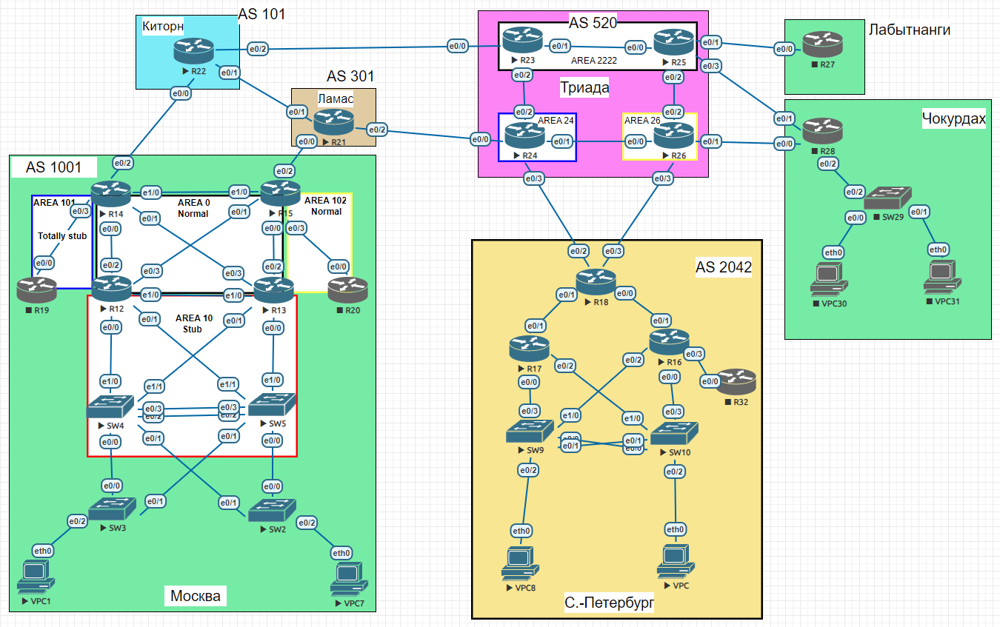

# VPN. GRE. DmVPN

### Выполнение

Лаботаторная схема сети


1. Настроим GRE между офисами Москва и С.-Петербург.
   ```
   Конфигурация на R15:
   R15# show running-config interface tunnel 0
   !
   interface Tunnel0
   description TUN-to-R18-PETERBURG
   ip address 10.0.3.15 255.255.255.0
   ip mtu 1400
   ip tcp adjust-mss 1360
   tunnel source Loopback1
   tunnel destination 123.18.18.1
   end
   !
   ip route 10.20.0.0 255.255.0.0 Tunnel0

   Конфигурация на R18:
   R18# show running-config interface tunnel 0
   !
   interface Tunnel0
   description TUN-to-R15-MOSKOW
   ip address 10.0.3.18 255.255.255.0
   ip mtu 1400
   ip tcp adjust-mss 1360
   tunnel source Loopback1
   tunnel destination 123.15.15.1
   end
   !
   ip route 10.10.0.0 255.255.0.0 Tunnel0
   
   Проверяем связность к VPC:
   !
   R15# ping 10.20.101.100
   Type escape sequence to abort.
   Sending 5, 100-byte ICMP Echos to 10.20.101.100, timeout is 2 seconds:
   !!!!!
   Success rate is 100 percent (5/5), round-trip min/avg/max = 2/3/6 ms
   !
   R18# ping 10.10.101.4
   Type escape sequence to abort.
   Sending 5, 100-byte ICMP Echos to 10.10.101.4, timeout is 2 seconds:
   !!!!!
   Success rate is 100 percent (5/5), round-trip min/avg/max = 2/3/7 ms
   ```
2. Настроим DMVPN между Москва и Чокурдах, Лабытнанги.
   