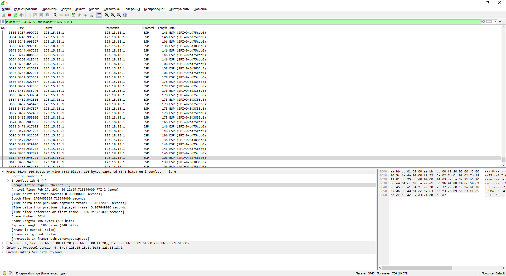
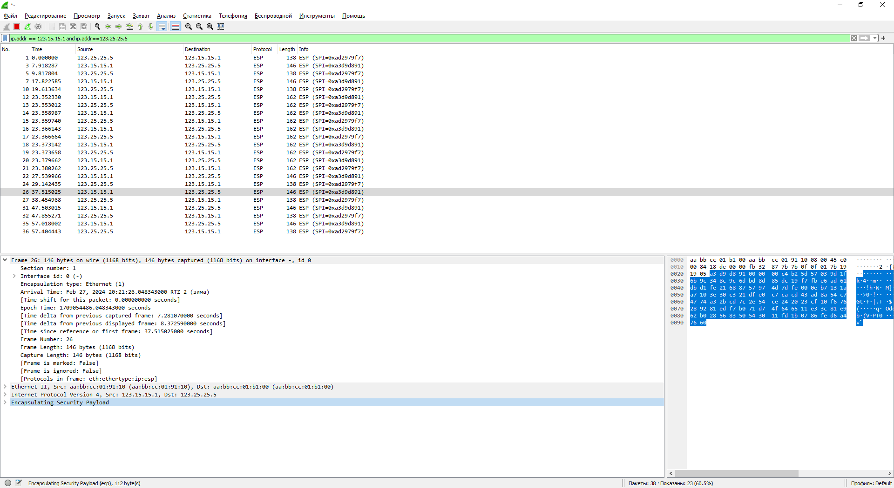

# IPSec over DmVPN

### Выполнение

Лаботаторная схема сети


1. Настроите GRE поверх IPSec между офисами Москва и С.-Петербург.
   ####
   Настройки на R15
   ```
   interface Tunnel0
   description TUN-to-R18-PETERBURG
   ip address 10.0.3.15 255.255.255.0
   ip mtu 1400
   ip tcp adjust-mss 1360
   tunnel source Loopback1
   tunnel destination 123.18.18.1
   tunnel protection ipsec profile GRE
   end
   !
   crypto pki server CA
   database level complete
   no database archive
   !
   crypto pki trustpoint CA
   revocation-check crl
   rsakeypair CA
   !
   crypto isakmp policy 5
   encr 3des
   hash sha256
   authentication pre-share
   group 19
   crypto isakmp key cisco address 0.0.0.0
   !
   crypto ipsec transform-set SET1 esp-3des
   mode tunnel
   !
   crypto ipsec profile GRE
   set transform-set SET1
   !
   crypto map MAP 5 ipsec-isakmp
   set peer 123.18.18.1
   set transform-set SET1
   match address 105
   !
   access-list 105 permit gre host 123.15.15.1 host 123.18.18.1
   ```
   Настройки на R18
   ```
   interface Tunnel0
   description TUN-to-R15-MOSKOW
   ip address 10.0.3.18 255.255.255.0
   ip mtu 1400
   ip tcp adjust-mss 1360
   tunnel source Loopback1
   tunnel destination 123.15.15.1
   tunnel protection ipsec profile GRE
   end
   !
   crypto pki trustpoint VPN
   enrollment url http://123.15.15.1:80
   serial-number
   ip-address 10.0.3.18
   subject-name CN=R18,OU=VPN,O=Server,C=RU
   revocation-check none
   rsakeypair VPN
   !
   crypto isakmp policy 5
   encr 3des
   hash sha256
   authentication pre-share
   group 19
   crypto isakmp key cisco address 123.15.15.1
   !
   crypto ipsec transform-set SET1 esp-3des
   mode tunnel
   !
   crypto ipsec profile GRE
   set transform-set SET1
   !
   crypto map MAP 5 ipsec-isakmp
   set peer 123.15.15.1
   set transform-set SET1
   match address 105
   !
   access-list 105 permit gre host 123.18.18.1 host 123.15.15.1
   ```
2. Настроите DMVPN поверх IPSec между Москва и Чокурдах, Лабытнанги.
   ####
   Произведем настройку R15:
   ```
   R15(config)# ip domain name otus.ru
   R15(config)# ip http server
   R15(config)# crypto key generate rsa label VPN modulus 2048
   
   The name for the keys will be: CA
   % The key modulus size is 2048 bits
   % Generating 2048 bit RSA keys, keys will be exportable...
   [OK] (elapsed time was 3 seconds)
   *Feb 27 09:45:16.779: %SSH-5-ENABLED: SSH 1.99 has been enabled
   
   R15(config)# crypto pki server CA
   R15(cs-server)# database level complete
   R15(cs-server)# no shutdown
   
   %Some server settings cannot be changed after CA certificate generation.
   % Please enter a passphrase to protect the private key
   % or type Return to exit
   Password:
   Re-enter password:
   % Certificate Server enabled.
   *Feb 27 09:45:52.546: %PKI-6-CS_ENABLED: Certificate server now enabled.

   R15# show crypto pki server CA requests
   
   Enrollment Request Database:
   Subordinate CA certificate requests:
   ReqID  State      Fingerprint                      SubjectName
   --------------------------------------------------------------
   RA certificate requests:
   ReqID  State      Fingerprint                      SubjectName
   --------------------------------------------------------------
   Router certificates requests:
   ReqID  State      Fingerprint                      SubjectName
   --------------------------------------------------------------
   1      pending    620A2913C62A765342BA892007C5E7CF serialNumber=67111345+hostname=R27.otus.ru,cn=R27,ou=VPN,o=Otus,c=RU
   2      pending    B5ADA7FEA1EEF43956100BB392459DF2 serialNumber=67111361+hostname=R28.otus.ru,cn=R28,ou=VPN,o=Otus,c=RU

   R15# crypto pki server CA grant 1
   R15# crypto pki server CA grant 2

   R15# show crypto pki certificates
   CA Certificate
   Status: Available
   Certificate Serial Number (hex): 01
   Certificate Usage: Signature
   Issuer:
   cn=CA
   Subject:
   cn=CA
   Validity Date:
   start date: 12:45:52 MSK Feb 27 2024
   end   date: 12:45:52 MSK Feb 26 2027
   Associated Trustpoints: CA
   Storage: nvram:CA#1CA.cer
   
   R15# ping 10.0.4.27
   Type escape sequence to abort.
   Sending 5, 100-byte ICMP Echos to 10.0.4.27, timeout is 2 seconds:
   !!!!!
   Success rate is 100 percent (5/5), round-trip min/avg/max = 7/7/8 ms
   
   R15#ping 10.0.4.28
   Type escape sequence to abort.
   Sending 5, 100-byte ICMP Echos to 10.0.4.28, timeout is 2 seconds:
   !!!!!
   Success rate is 100 percent (5/5), round-trip min/avg/max = 6/7/9 ms
   ```
   Итоговый конфиг R15:
   ```
   interface Tunnel1
   ip address 10.0.4.15 255.255.255.0
   no ip redirects
   ip mtu 1400
   ip nhrp map multicast dynamic
   ip nhrp network-id 1
   ip tcp adjust-mss 1360
   ip ospf network broadcast
   ip ospf priority 255
   ip ospf 1 area 3
   tunnel source Loopback1
   tunnel mode gre multipoint
   tunnel protection ipsec profile DMVPN
   !
   crypto pki server CA
   database level complete
   no database archive
   !
   crypto pki trustpoint CA
   revocation-check crl
   rsakeypair CA
   !
   crypto pki certificate chain CA
   certificate ca 01
   308202F8 308201E0 A0030201 02020101 300D0609 2A864886 F70D0101 04050030
   0D310B30 09060355 04031302 4341301E 170D3234 30323237 30393435 35325A17
   0D323730 32323630 39343535 325A300D 310B3009 06035504 03130243 41308201
   22300D06 092A8648 86F70D01 01010500 0382010F 00308201 0A028201 0100B62D
   6D7853A3 7C7A5DA8 9778594E 2B19845C 234A9F51 A4443F48 D1FA3CB3 7D9DFC9B
   CE12AE9F E36D49FA 359244A8 9C4FE686 DD5D0C8A F6673DBA 9EE05E51 DB980F24
   A923764F D45ECD0D 9DE3FB08 13DD4FD1 373398C2 1A0FEB83 50E629D6 62F15AFC
   59DAB64B C9E1FD38 97940860 2914B295 364066E2 F55FE203 411745CA D38388F0
   AC4A5135 61F379DD 9C1DAAB3 C6D89647 2BDD6451 42CC8099 C4E11F3C 5ABA4394
   B73A94C9 1AE13E8B 6993AC63 FB0A301B 0F4E9652 906DA722 E520E210 01B01C84
   F4E9DC0C EA649260 2D541960 FF2744FE EB85C9A6 0F01C11F F06F35D1 A8669ACE
   D6FC8A55 205457C0 97A36449 30B0AD8C 4FAAF82D 64156004 520D6B8E 14AF0203
   010001A3 63306130 0F060355 1D130101 FF040530 030101FF 300E0603 551D0F01
   01FF0404 03020186 301F0603 551D2304 18301680 14E18AAD 507DF2A4 1D6A15DE
   43A020B7 59301EB5 75301D06 03551D0E 04160414 E18AAD50 7DF2A41D 6A15DE43
   A020B759 301EB575 300D0609 2A864886 F70D0101 04050003 82010100 9F21050C
   9D05D544 DC5D9DEC 654A3C56 6D5557C9 572D87E7 3A5C5CCE 95A42D1A 5EBC8E34
   F56FE609 1EF8AA66 E4116651 684C2651 A3BC5A87 76771262 D3780C6E 1B37C61D
   AC017254 C0899521 5C3179C6 54EB02F1 8C75B32B 154FF991 F442D618 F6B02386
   7806DB20 6E477F8B 1338B976 79BBDCB7 46ECC4F4 43774C69 3B8B2EDD 73D9F973
   FB1EB209 C71DC7EB 7FB4B4A2 C4923E47 6921E709 9177AE65 1D174722 D6E18DC8
   A6B8575E C91B91A8 E4F63B8D 30E7F9FA CE289756 6687A9FC 5C260C67 A10D29DB
   37140A5D FFF0494E 39C4B87E A6AAEC33 0CE7E133 287E646C BBFEEA46 48CCF3D1
   8A770D53 0A028F08 C2AB0CE6 C28020D2 5891E590 BCAED132 D9E9EDB7
   quit
   !
   redundancy
   !
   crypto isakmp policy 5
   encr 3des
   hash sha256
   authentication pre-share
   group 19
   crypto isakmp key cisco address 0.0.0.0
   !
   crypto ipsec transform-set SET2 esp-3des
   mode transport
   !
   crypto ipsec profile DMVPN
   set transform-set SET2
   ```
   Произведем настройку R27:
   ```
   R27(config)# ip domain-name otus.ru
   R27(config)# crypto key generate rsa label VPN modulus 2048

   The name for the keys will be: VPN
   % The key modulus size is 2048 bits
   % Generating 2048 bit RSA keys, keys will be non-exportable...
   [OK] (elapsed time was 2 seconds)
   *Feb 27 09:46:45.889: %SSH-5-ENABLED: SSH 1.99 has been enabled

   R27(config)# crypto pki trustpoint VPN
   R27(ca-trustpoint)# enrollment url http://123.15.15.1
   R27(ca-trustpoint)# subject-name CN=R27,OU=VPN,O=Otus,C=RU
   R27(ca-trustpoint)# rsakeypair VPN
   R27(ca-trustpoint)# revocation-check none

   R27(config)# crypto pki authenticate VPN

   Certificate has the following attributes:
   Fingerprint MD5: 2BD703EF 22B14F8F 013587EF 8E99F39F
   Fingerprint SHA1: 86DF921B 475F9094 58666C04 DB9886B1 518D363E
   % Do you accept this certificate? [yes/no]: y
   Trustpoint CA certificate accepted.
   
   R27(config)# crypto pki enroll VPN
   %
   % Start certificate enrollment ..
   % Create a challenge password. You will need to verbally provide this
   password to the CA Administrator in order to revoke your certificate.
   For security reasons your password will not be saved in the configuration.
   Please make a note of it.
   Password:
   Re-enter password:
   % The subject name in the certificate will include: CN=R27,OU=VPN,O=Otus,C=RU
   % The subject name in the certificate will include: R27.otus.ru
   % Include the router serial number in the subject name? [yes/no]: y
   % The serial number in the certificate will be: 67111345
   % Include an IP address in the subject name? [no]:
   Request certificate from CA? [yes/no]: y
   % Certificate request sent to Certificate Authority
   % The 'show crypto pki certificate verbose VPN' commandwill show the fingerprint                                                                                                                                                             .
   *Feb 27 09:55:38.171: CRYPTO_PKI:  Certificate Request Fingerprint MD5: 620A2913                                                                                                                                                              C62A7653 42BA8920 07C5E7CF
   *Feb 27 09:55:38.172: CRYPTO_PKI:  Certificate Request Fingerprint SHA1: 27A053E                                                                                                                                                             E 1A05D004 89881989 B0912621 594ED427
   *Feb 27 09:57:39.071: %PKI-6-CERTRET: Certificate received from Certificate Authority

   R27# show crypto pki certificates
   
   Certificate
   Status: Available
   Certificate Serial Number (hex): 02
   Certificate Usage: General Purpose
   Issuer:
   cn=CA
   Subject:
   Name: R27.otus.ru
   Serial Number: 67111345
   serialNumber=67111345+hostname=R27.otus.ru
   cn=R27
   ou=VPN
   o=Otus
   c=RU
   Validity Date:
   start date: 12:56:57 MSK Feb 27 2024
   end   date: 12:56:57 MSK Feb 26 2025
   Associated Trustpoints: VPN
   
   CA Certificate
   Status: Available
   Certificate Serial Number (hex): 01
   Certificate Usage: Signature
   --More--
   *Feb 27 10:19:24.994: %SYS-5-CONFIG_I: Configured from console by console
   Issuer:
   cn=CA
   Subject:
   cn=CA
   Validity Date:
   start date: 12:45:52 MSK Feb 27 2024
   end   date: 12:45:52 MSK Feb 26 2027
   Associated Trustpoints: VPN
   ```
   Итоговый конфиг R27:
   ```
   interface Tunnel1
   ip address 10.0.4.27 255.255.255.0
   no ip redirects
   ip mtu 1400
   ip nhrp map 10.0.4.15 123.15.15.1
   ip nhrp map multicast 123.15.15.1
   ip nhrp network-id 1
   ip nhrp nhs 10.0.4.15
   ip nhrp registration no-unique
   ip tcp adjust-mss 1360
   ip ospf network broadcast
   ip ospf priority 0
   ip ospf 1 area 3
   tunnel source Loopback1
   tunnel mode gre multipoint
   tunnel protection ipsec profile DMVPN
   !
   crypto pki trustpoint VPN
   enrollment url http://123.15.15.1:80
   serial-number
   ip-address 10.0.4.27
   subject-name CN=R27,OU=VPN,O=Otus,C=RU
   revocation-check none
   rsakeypair VPN
   !
   crypto pki certificate chain VPN
   certificate 02
   3082033C 30820224 A0030201 02020102 300D0609 2A864886 F70D0101 05050030
   0D310B30 09060355 04031302 4341301E 170D3234 30323237 30393536 35375A17
   0D323530 32323630 39353635 375A3065 310B3009 06035504 06130252 55310D30
   0B060355 040A1304 4F747573 310C300A 06035504 0B130356 504E310C 300A0603
   55040313 03523237 312B300F 06035504 05130836 37313131 33343530 1806092A
   864886F7 0D010902 160B5232 372E6F74 75732E72 75308201 22300D06 092A8648
   86F70D01 01010500 0382010F 00308201 0A028201 0100B885 78623493 987E0218
   D6431A8B E18543B0 AADDBF76 4A7A59BA ABAD72BB D6BC62C7 9458F124 9A6087AE
   16F7320B 7F34E908 8A24F223 CF49E844 CE7CD931 1F9C5A65 56D91946 2F350C89
   0AF7B118 B27326F4 ED6CDBD6 4A491295 4A6198DE 9DF8C52D 3DAE5F57 ABB48CD8
   34CD821D 5B3242AE CE60C8EF CECA6900 537A9836 C38194ED 7A711394 79F1951F
   AD1F4EBD 441D4107 B7E2AEC4 203F72D9 826776E5 72BC01BD 397412E9 EAD77944
   A811F227 4640DCDC C9DE6553 BED38C76 E1E5C556 B5956440 E0E91F21 1483B819
   7C12AD69 A0539941 B09F1AC2 33237200 DD84044B 0AD3056C 519358A7 A6365C6B
   7F1F1B47 4CA74634 57F9C285 5050DD55 076BEB0A C14B0203 010001A3 4F304D30
   0B060355 1D0F0404 030205A0 301F0603 551D2304 18301680 14E18AAD 507DF2A4
   1D6A15DE 43A020B7 59301EB5 75301D06 03551D0E 04160414 9D008230 41B678A1
   254BC29F 2E2446E8 80740670 300D0609 2A864886 F70D0101 05050003 82010100
   7FD90F8E 261FB23F 9BEBE0C8 CF5EEDBF 9A05887F D6A4BA2B 623D6C54 6A89E2DE
   0B92BF6D 868E9447 F8DE0D12 6DF7E437 8116CF58 89930619 FB689A22 56357159
   266F3A79 75E58797 6A4E7D93 5BA7F2D4 709D439D E5175B23 CC760FFF D6C3D63D
   0BEFDA52 C84377B8 00C61EBC D43F0D03 56D2CF0B 5D895D21 5FA629D7 6D130F93
   447FAE7B D587ADC3 6A4BD718 3DE8BDC2 ED2CBD24 915E9004 353F786A 2388C841
   9A3DB6BF A8FB729D 3948281A DEF3EB86 89ECD4C6 8C156554 BDAAF243 50FCA0C9
   5EFDBE96 C604CE3D 30271B01 C3935057 5511EBF8 E51FFD9E F3ABBEB6 998C9436
   BE390BD8 E1AEDB8B 97EC6BA5 FE23423B AF9215D0 B7208392 F6674DE1 D61227E3
   quit
   certificate ca 01
   308202F8 308201E0 A0030201 02020101 300D0609 2A864886 F70D0101 04050030
   0D310B30 09060355 04031302 4341301E 170D3234 30323237 30393435 35325A17
   0D323730 32323630 39343535 325A300D 310B3009 06035504 03130243 41308201
   22300D06 092A8648 86F70D01 01010500 0382010F 00308201 0A028201 0100B62D
   6D7853A3 7C7A5DA8 9778594E 2B19845C 234A9F51 A4443F48 D1FA3CB3 7D9DFC9B
   CE12AE9F E36D49FA 359244A8 9C4FE686 DD5D0C8A F6673DBA 9EE05E51 DB980F24
   A923764F D45ECD0D 9DE3FB08 13DD4FD1 373398C2 1A0FEB83 50E629D6 62F15AFC
   59DAB64B C9E1FD38 97940860 2914B295 364066E2 F55FE203 411745CA D38388F0
   AC4A5135 61F379DD 9C1DAAB3 C6D89647 2BDD6451 42CC8099 C4E11F3C 5ABA4394
   B73A94C9 1AE13E8B 6993AC63 FB0A301B 0F4E9652 906DA722 E520E210 01B01C84
   F4E9DC0C EA649260 2D541960 FF2744FE EB85C9A6 0F01C11F F06F35D1 A8669ACE
   D6FC8A55 205457C0 97A36449 30B0AD8C 4FAAF82D 64156004 520D6B8E 14AF0203
   010001A3 63306130 0F060355 1D130101 FF040530 030101FF 300E0603 551D0F01
   01FF0404 03020186 301F0603 551D2304 18301680 14E18AAD 507DF2A4 1D6A15DE
   43A020B7 59301EB5 75301D06 03551D0E 04160414 E18AAD50 7DF2A41D 6A15DE43
   A020B759 301EB575 300D0609 2A864886 F70D0101 04050003 82010100 9F21050C
   9D05D544 DC5D9DEC 654A3C56 6D5557C9 572D87E7 3A5C5CCE 95A42D1A 5EBC8E34
   F56FE609 1EF8AA66 E4116651 684C2651 A3BC5A87 76771262 D3780C6E 1B37C61D
   AC017254 C0899521 5C3179C6 54EB02F1 8C75B32B 154FF991 F442D618 F6B02386
   7806DB20 6E477F8B 1338B976 79BBDCB7 46ECC4F4 43774C69 3B8B2EDD 73D9F973
   FB1EB209 C71DC7EB 7FB4B4A2 C4923E47 6921E709 9177AE65 1D174722 D6E18DC8
   A6B8575E C91B91A8 E4F63B8D 30E7F9FA CE289756 6687A9FC 5C260C67 A10D29DB
   37140A5D FFF0494E 39C4B87E A6AAEC33 0CE7E133 287E646C BBFEEA46 48CCF3D1
   8A770D53 0A028F08 C2AB0CE6 C28020D2 5891E590 BCAED132 D9E9EDB7
   quit
   !
   redundancy
   !
   crypto isakmp policy 5
   encr 3des
   hash sha256
   authentication pre-share
   group 19
   crypto isakmp key cisco address 0.0.0.0
   !
   crypto ipsec transform-set SET2 esp-3des
   mode transport
   !
   crypto ipsec profile DMVPN
   set transform-set SET2
   !
   ```
   Произведем настройку R28:
   ```   
   Настройка аналогична настройки R27
   R28# show crypto pki certificates
   Certificate
   Status: Available
   Certificate Serial Number (hex): 03
   Certificate Usage: General Purpose
   Issuer:
   cn=CA
   Subject:
   Name: R28
   Serial Number: 67111361
   serialNumber=67111361+hostname=R28
   cn=R28
   ou=VPN
   o=Otus
   c=RU
   Validity Date:
   start date: 13:14:38 MSK Feb 27 2024
   end   date: 13:14:38 MSK Feb 26 2025
   Associated Trustpoints: VPN
   Storage: nvram:CA#3.cer
   
   CA Certificate
   Status: Available
   Certificate Serial Number (hex): 01
   Certificate Usage: Signature
   Issuer:
   cn=CA
   Subject:
   cn=CA
   Validity Date:
   start date: 12:45:52 MSK Feb 27 2024
   end   date: 12:45:52 MSK Feb 26 2027
   Associated Trustpoints: VPN
   Storage: nvram:CA#1CA.cer
   ```
   Итоговый конфиг R28:
   ```
   interface Tunnel1
   ip address 10.0.4.28 255.255.255.0
   no ip redirects
   ip mtu 1400
   ip nhrp map 10.0.4.15 123.15.15.1
   ip nhrp map multicast 123.15.15.1
   ip nhrp network-id 1
   ip nhrp nhs 10.0.4.15
   ip tcp adjust-mss 1360
   ip ospf network broadcast
   ip ospf priority 0
   ip ospf 1 area 3
   tunnel source Loopback1
   tunnel mode gre multipoint
   tunnel protection ipsec profile DMVPN
   !
   crypto pki trustpoint VPN
   enrollment url http://123.15.15.1:80
   serial-number
   ip-address 10.0.4.28
   subject-name CN=R28,OU=VPN,O=Otus,C=RU
   revocation-check none
   rsakeypair VPN
   !
   crypto pki certificate chain VPN
   certificate 03
   30820334 3082021C A0030201 02020103 300D0609 2A864886 F70D0101 05050030
   0D310B30 09060355 04031302 4341301E 170D3234 30323237 31303134 33385A17
   0D323530 32323631 30313433 385A305D 310B3009 06035504 06130252 55310D30
   0B060355 040A1304 4F747573 310C300A 06035504 0B130356 504E310C 300A0603
   55040313 03523238 3123300F 06035504 05130836 37313131 33363130 1006092A
   864886F7 0D010902 16035232 38308201 22300D06 092A8648 86F70D01 01010500
   0382010F 00308201 0A028201 0100DB75 D9371599 D27C54FB EE46F90E 3C639368
   E970156E 1FA37307 446AE1C1 0B9996E6 01158103 3AC094F4 2C60D433 25FBADE3
   474B644B 1B621CBA 8D7B4489 801FF5D8 29CC95BD C623DBD8 35C29349 5EF234CF
   BAD9EA64 F9CD91DD BCE9B750 40E4E3FB 9FA56740 F0181226 83968F61 67DE1BBC
   A33E6848 D297B0CB 31F50EDF 0C491258 F351C92F A1E7B412 870FA20A 5649147A
   3C216117 A7A49F9F 9D2B6052 526CAB7C 4A89FE14 3C02EF24 4BCBF005 7CD50443
   C0B61E9E 007B2649 840E61E1 872AAB57 D0761171 9F1B087F AB0AC5DE 7064077F
   7BAACF0B 60FF9787 EF5D5B97 C5F09107 55A1EE51 890C7CB7 95C90F68 5129A65B
   18E41A53 98114B97 F3F47D2A 8AA30203 010001A3 4F304D30 0B060355 1D0F0404
   030205A0 301F0603 551D2304 18301680 14E18AAD 507DF2A4 1D6A15DE 43A020B7
   59301EB5 75301D06 03551D0E 04160414 6E2144F0 A27AF7C3 7EE0214A 8F49FFC0
   8DFFC738 300D0609 2A864886 F70D0101 05050003 82010100 B095DEDE 14CB4A10
   BB8D48E9 5555EC3B 6C8DC894 CAED081A F5943091 4AD68F91 8C970CFC C003172F
   22787B62 B8F030F6 3679FF89 60740539 B1D7B235 30D600B8 FB7EEC3C D0AACB85
   477FA687 65738361 8563D73D 1A7E43A4 0118F57C 344F5BF3 9FCB9B88 151FB6CC
   5DC2B8A3 03AC58C2 E1FF9044 B3FBDCFC C06C1198 2011BB55 59484366 9A8FAA84
   689C13E1 97360980 18D5348A AD771365 FBD3D88A 2A788BB7 1EEF4C4C 5B5706A5
   897C8B9E A5831624 04044EE9 27D4A708 CAF5EC42 1F55A197 24678D61 A7AB2221
   720B3E27 CC2F8688 2EEB6F97 1C104119 AFBBCD28 D7B8096D D1A15899 52ACDDB9
   3C703464 89DA7D60 7BEBEC5A 24AB60F8 8E38C68E CAA3DA46
   quit
   certificate ca 01
   308202F8 308201E0 A0030201 02020101 300D0609 2A864886 F70D0101 04050030
   0D310B30 09060355 04031302 4341301E 170D3234 30323237 30393435 35325A17
   0D323730 32323630 39343535 325A300D 310B3009 06035504 03130243 41308201
   22300D06 092A8648 86F70D01 01010500 0382010F 00308201 0A028201 0100B62D
   6D7853A3 7C7A5DA8 9778594E 2B19845C 234A9F51 A4443F48 D1FA3CB3 7D9DFC9B
   CE12AE9F E36D49FA 359244A8 9C4FE686 DD5D0C8A F6673DBA 9EE05E51 DB980F24
   A923764F D45ECD0D 9DE3FB08 13DD4FD1 373398C2 1A0FEB83 50E629D6 62F15AFC
   59DAB64B C9E1FD38 97940860 2914B295 364066E2 F55FE203 411745CA D38388F0
   AC4A5135 61F379DD 9C1DAAB3 C6D89647 2BDD6451 42CC8099 C4E11F3C 5ABA4394
   B73A94C9 1AE13E8B 6993AC63 FB0A301B 0F4E9652 906DA722 E520E210 01B01C84
   F4E9DC0C EA649260 2D541960 FF2744FE EB85C9A6 0F01C11F F06F35D1 A8669ACE
   D6FC8A55 205457C0 97A36449 30B0AD8C 4FAAF82D 64156004 520D6B8E 14AF0203
   010001A3 63306130 0F060355 1D130101 FF040530 030101FF 300E0603 551D0F01
   01FF0404 03020186 301F0603 551D2304 18301680 14E18AAD 507DF2A4 1D6A15DE
   43A020B7 59301EB5 75301D06 03551D0E 04160414 E18AAD50 7DF2A41D 6A15DE43
   A020B759 301EB575 300D0609 2A864886 F70D0101 04050003 82010100 9F21050C
   9D05D544 DC5D9DEC 654A3C56 6D5557C9 572D87E7 3A5C5CCE 95A42D1A 5EBC8E34
   F56FE609 1EF8AA66 E4116651 684C2651 A3BC5A87 76771262 D3780C6E 1B37C61D
   AC017254 C0899521 5C3179C6 54EB02F1 8C75B32B 154FF991 F442D618 F6B02386
   7806DB20 6E477F8B 1338B976 79BBDCB7 46ECC4F4 43774C69 3B8B2EDD 73D9F973
   FB1EB209 C71DC7EB 7FB4B4A2 C4923E47 6921E709 9177AE65 1D174722 D6E18DC8
   A6B8575E C91B91A8 E4F63B8D 30E7F9FA CE289756 6687A9FC 5C260C67 A10D29DB
   37140A5D FFF0494E 39C4B87E A6AAEC33 0CE7E133 287E646C BBFEEA46 48CCF3D1
   8A770D53 0A028F08 C2AB0CE6 C28020D2 5891E590 BCAED132 D9E9EDB7
   quit
   !
   redundancy
   !
   crypto isakmp policy 5
   encr 3des
   hash sha256
   authentication pre-share
   group 19
   crypto isakmp key cisco address 0.0.0.0
   !
   crypto ipsec transform-set SET2 esp-3des
   mode transport
   !
   crypto ipsec profile DMVPN
   set transform-set SET2
   !
   ```
3. Все узлы в офисах в лабораторной работе должны иметь IP связность.
   ```
   R15# ping 10.0.3.18
   Type escape sequence to abort.
   Sending 5, 100-byte ICMP Echos to 10.0.3.18, timeout is 2 seconds:
   !!!!!
   Success rate is 100 percent (5/5), round-trip min/avg/max = 6/6/7 ms
   R15# traceroute 10.0.3.18
   Type escape sequence to abort.
   Tracing the route to 10.0.3.18
   VRF info: (vrf in name/id, vrf out name/id)
   1 10.0.3.18 7 msec 7 msec *
   ```
   
   ```
   R15# ping 10.0.4.27
   Type escape sequence to abort.
   Sending 5, 100-byte ICMP Echos to 10.0.4.27, timeout is 2 seconds:
   !!!!!
   Success rate is 100 percent (5/5), round-trip min/avg/max = 4/6/7 ms
   !
   R15# traceroute 10.0.4.27
   Type escape sequence to abort.
   Tracing the route to 10.0.4.27
   VRF info: (vrf in name/id, vrf out name/id)
   1 10.0.4.27 8 msec 8 msec *
   ```
   
   ```
   R15# ping 10.0.4.28
   Type escape sequence to abort.
   Sending 5, 100-byte ICMP Echos to 10.0.4.28, timeout is 2 seconds:
   !!!!!
   Success rate is 100 percent (5/5), round-trip min/avg/max = 6/7/8 ms
   R15# traceroute 10.0.4.28
   Type escape sequence to abort.
   Tracing the route to 10.0.4.28
   VRF info: (vrf in name/id, vrf out name/id)
   1 10.0.4.28 7 msec 7 msec *
   ```
   