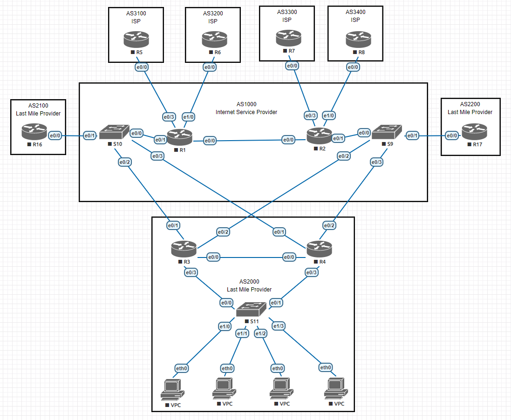

# Сеть сервис провайдера с клиентcкими подключениями различных типов

### Выполнение

Лаботаторная схема сети


1. Проектирование лабораторной схемы сети интернет серрвис провайдера.
   ####
   Исходя из полученных в курсе навыков была спроэктирована и предложена лаботаторна схема сети, в которой предусмотрены минимально необходимые средсва для запуска сети интернет сервис провайдера с сегментом сети последней мили.
   ####
   Для реализиции поставленной задачи желательно у ISP провайдера наличие 2-х автономных систем, для разделения сервисов IP транзит (AS1000) и предоставление услуги интернет конечным пользователям (AS2000).
   ####
2. Распределяем и документируем адресное пространсво для лабораторного стенда.
   ####
   Выделим отдельное /16 адресное пространспо под каждую автономную систему, а при наличии 2-х роутеров на каждый роутер, сети взяты исключительно для наглядности и удобства диагностики и настройки.
   ```
   AS1000 R1 - 123.1.0.0/16 (наша зона ответсвенности) 
          R2 - 123.2.0.0/16 (наша зона ответсвенности)
   AS2000 R3 - 123.3.0.0/16 (наша зона ответсвенности)
          R4 - 123.4.0.0/16 (наша зона ответсвенности)
   AS3100 R5 - 123.5.0.0/16 (ЗО вышестоящего партнера)
   AS3200 R6 - 123.6.0.0/16 (ЗО вышестоящего партнера)
   AS3300 R7 - 123.7.0.0/16 (ЗО вышестоящего партнера)
   AS3400 R8 - 123.8.0.0/16 (ЗО вышестоящего партнера)
   AS2100 R16 - 123.16.0.0/16 (ЗО нижестоящего партнера)
   AS2200 R17 - 123.17.0.0/16 (ЗО нижестоящего партнера)
   ```
   Настраиваем ip адреса на каждом активном порту

   | Hostname  | Interface        | Description      | IPv4-address    | Gateway |
   |-----------|------------------|------------------|-----------------|---------|
   | ✔ **R1**  | Loopback0        |                  | 123.1.0.254/32  |         |
   |           | Ethernet0/0      | pp.to-R2-AS1000  | 123.1.1.6/31    |         |
   |           | Ethernet0/1.2000 | ds.to-AS2000     | 123.1.1.10/31   |         |
   |           | Ethernet0/1.2100 | ds.to-R16-AS2100 | 123.1.1.8/31    |         |
   |           | Ethernet0/3      | up.to-R5-AS3100  | 123.1.1.2/31    |         |  
   |           | Ethernet1/0      | up.to-R6-AS3200  | 123.1.1.4/31    |         |
   | ✔ **R2**  | Loopback0        |                  | 123.2.0.254/32  |         |
   |           | Ethernet0/0      | pp.to-R1-AS1000  | 123.1.1.7/31    |         |
   |           | Ethernet0/1.2000 | ds.to-AS2000     | 123.2.1.10/31   |         |
   |           | Ethernet0/1.2200 | ds.to-R17-AS2200 | 123.2.1.8/31    |         |
   |           | Ethernet0/3      | up.to-R7-AS3300  | 123.2.1.2/31    |         |
   |           | Ethernet1/0      | up.to-R8-AS3400  | 123.2.1.4/31    |         |
   | ✔ **R3**  | Loopback0        |                  | 123.3.0.254/32  |         |
   |           | Loopback1        |                  | 123.1.101.1/24  |         |
   |           | Ethernet0/0      | pp.to-R4-AS2000  | 123.3.1.2/31    |         |
   |           | Ethernet0/1      | up.to-R1-AS1000  | 123.1.1.11/31   |         |
   |           | Ethernet0/1.200  | pp.to-R4-AS2000  | 123.3.1.4/31    |         |
   |           | Ethernet0/2      | up.to-R2-AS1000  | 123.2.1.11/31   |         |
   |           | Ethernet0/2.200  | pp.to-R4-AS2000  | 123.3.1.6/31    |         |
   |           | Ethernet0/3.101  | ds.to-VPC        | 123.3.101.1/24  |         |
   |           | Ethernet0/3.102  | ds.to-VPC        | 123.3.102.2/23  |         |
   |           | Ethernet0/3.103  | ds.to-VPC        | 123.3.104.2/23  |         |
   | ✔ **R4**  | Loopback0        |                  | 123.4.0.254/32  |         |
   |           | Loopback1        |                  | 123.1.101.1/24  |         |
   |           | Ethernet0/0      | pp.to-R3-AS2000  | 123.3.1.3/31    |         |
   |           | Ethernet0/1      | up.to-R1-AS1000  | 123.1.1.13/31   |         |
   |           | Ethernet0/1.200  | pp.to-R3-AS2000  | 123.3.1.5/31    |         |
   |           | Ethernet0/2      | up.to-R2-AS1000  | 123.2.1.13/31   |         |
   |           | Ethernet0/2.200  | pp.to-R3-AS2000  | 123.3.1.7/31    |         |
   |           | Ethernet0/3.101  | ds.to-VPC        | 123.3.101.1/24  |         |
   |           | Ethernet0/3.102  | ds.to-VPC        | 123.3.102.3/23  |         |
   |           | Ethernet0/3.103  | ds.to-VPC        | 123.3.104.3/23  |         |
   | ✔ **R5**  | Loopback0        |                  | 123.5.0.254/32  |         |
   |           | Ethernet0/0      | ds.to-R1-AS1000  | 123.1.1.3/31    |         |
   | ✔ **R6**  | Loopback0        |                  | 123.6.0.254/32  |         |
   |           | Ethernet0/0      | ds.to-R1-AS1000  | 123.1.1.5/31    |         |
   | ✔ **R7**  | Loopback0        |                  | 123.7.0.254/32  |         |
   |           | Ethernet0/0      | ds.to-R2-AS1000  | 123.2.1.3/31    |         |
   | ✔ **R8**  | Loopback0        |                  | 123.8.0.254/32  |         |
   |           | Ethernet0/0      | ds.to-R2-AS1000  | 123.2.1.5/31    |         |
   | ✔ **R16** | Loopback0       |                  | 123.16.0.254/32 |         |
   |           | Ethernet0/0      | up.to-R1-AS1000  | 123.1.1.9/31    |         |
   | ✔ **R17** | Loopback0       |                  | 123.17.0.254/32 |         |
   |           | Ethernet0/0      | up.to-R2-AS1000  | 123.2.1.9/31    |         |
3. Настроим связность между роутерами, проверим что соседство установилось, т.к. в схеме R1 и R2 являются транзитными для всех партнеров, проверим соседство на них:
   ```
   R1# show ip bgp summary
   Neighbor        V           AS MsgRcvd MsgSent   TblVer  InQ OutQ Up/Down  State/PfxRcd
   123.1.1.3       4         3100      20      29       11    0    0 00:14:31        1
   123.1.1.5       4         3200      20      27       11    0    0 00:14:38        1
   123.1.1.7       4         1000      58      61       11    0    0 00:46:57        6
   123.1.1.9       4         2100      11      21       11    0    0 00:05:43        1
   123.1.1.11      4         2000      24      21       11    0    0 00:05:35        2
   123.1.1.13      4         2000      19      21       11    0    0 00:05:47        2
   ```
   ```
   R2# show ip bgp summary
   Neighbor        V           AS MsgRcvd MsgSent   TblVer  InQ OutQ Up/Down  State/PfxRcd
   123.1.1.6       4         1000      62      59       13    0    0 00:48:15        6
   123.2.1.3       4         3300      22      30       13    0    0 00:15:53        1
   123.2.1.5       4         3400      21      32       13    0    0 00:15:52        1
   123.2.1.9       4         2200      12      24       13    0    0 00:07:00        1
   123.2.1.11      4         2000      23      23       13    0    0 00:06:43        2
   123.2.1.13      4         2000      23      24       13    0    0 00:06:55        2
   ```
   Проверим доступность сетей партнеров:
   ```
   R1#ping 123.8.0.254
   Type escape sequence to abort.
   Sending 5, 100-byte ICMP Echos to 123.8.0.254, timeout is 2 seconds:
   !!!!!
   Success rate is 100 percent (5/5), round-trip min/avg/max = 1/1/1 ms
   R1#ping 123.7.0.254
   Type escape sequence to abort.
   Sending 5, 100-byte ICMP Echos to 123.7.0.254, timeout is 2 seconds:
   !!!!!
   Success rate is 100 percent (5/5), round-trip min/avg/max = 1/1/1 ms
   R1#ping 123.6.0.254
   Type escape sequence to abort.
   Sending 5, 100-byte ICMP Echos to 123.6.0.254, timeout is 2 seconds:
   !!!!!
   Success rate is 100 percent (5/5), round-trip min/avg/max = 1/1/1 ms
   R1#ping 123.6.0.254
   Type escape sequence to abort.
   Sending 5, 100-byte ICMP Echos to 123.6.0.254, timeout is 2 seconds:
   !!!!!
   Success rate is 100 percent (5/5), round-trip min/avg/max = 1/1/1 ms
   R1#ping 123.4.0.254
   Type escape sequence to abort.
   Sending 5, 100-byte ICMP Echos to 123.4.0.254, timeout is 2 seconds:
   !!!!!
   Success rate is 100 percent (5/5), round-trip min/avg/max = 1/1/1 ms
   R1#ping 123.3.0.254
   Type escape sequence to abort.
   Sending 5, 100-byte ICMP Echos to 123.3.0.254, timeout is 2 seconds:
   !!!!!
   Success rate is 100 percent (5/5), round-trip min/avg/max = 1/1/2 ms
   ```
4. 
4. 